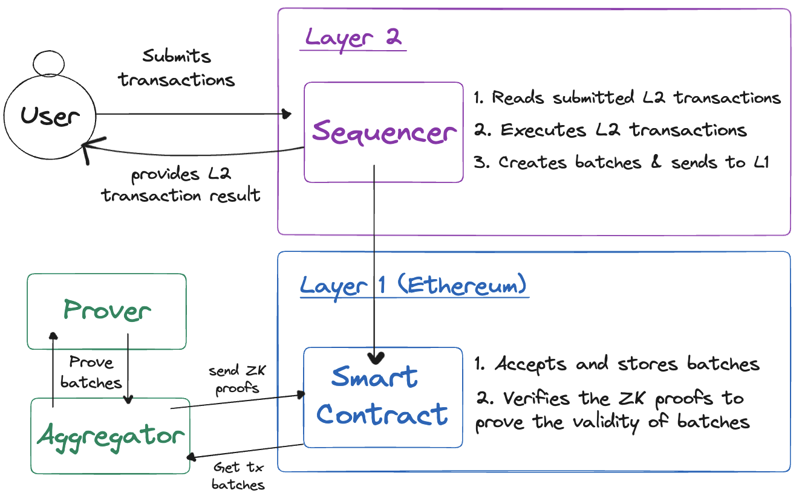

# Architecture

While each chain built with the CDK is unique, they all share a common high-level architecture. Before diving into the specifics of how [transactions](./transaction-lifecycle.md) are processed, it&rsquo;s helpful to first understand the role of each component in the system.

## Users

Chains built with the CDK are EVM-compatible by default. While the [type of zkEVM](https://docs.polygon.technology/cdk/architecture/type-1-prover/intro-t1-prover/#type-definitions) you choose to implement is customizable, CDK chains are designed to be compatible with existing Ethereum tools and libraries.

This means both users and developers can use the same wallets (such as MetaMask) and libraries (such as Ethers.js) that they use to interact with Ethereum to interact with chains built with the CDK.

The process to submit transactions is the same as Ethereum, using the same [JSON-RPC](https://ethereum.org/en/developers/docs/apis/json-rpc/) interface. Transactions are submitted directly to the L2 and go into a pending transaction pool.

## Sequencer

The sequencer is responsible for two vital tasks in the system:

1. Executing transactions submitted by users on the L2.
2. Sending batches of transactions to the L1 smart contract.

The sequencer reads transactions from the pending transaction pool and executes them on the L2, effectively updating the state of the L2 and providing this information back to the user. Once this process is complete _(typically in a matter of seconds)_, users are free to continue interacting with the L2 as if the transaction was finalized.

In the background, the sequencer also periodically creates batches of transactions together and sends multiple batches of transactions to the L1 smart contract in a single transaction.

## L1 Smart Contracts

Deployed on the L1 (Ethereum), multiple smart contracts work together to finalize transactions received from the L2 on the L1. Typically there is a main &ldquo;rollup&rdquo; smart contract that is responsible for:

1. Receiving and storing batches of transactions from the L2 (depending on the design of the L2, it may not use Ethereum for [data availability](https://docs.polygon.technology/cdk/glossary/#data-availability)).

2. Receiving and verifying ZK-proofs from the aggregator.

## Aggregator & Prover

The aggregator is responsible for periodically reading batches of transactions from the L2 that have not been verified yet, and generating ZK-proofs for them to prove their validity.

To do this, the aggregator sends the batches of transactions to a **prover**. The prover generates ZK proofs and sends them back to the aggregator, which then posts the proofs back to the L1 smart contract.
