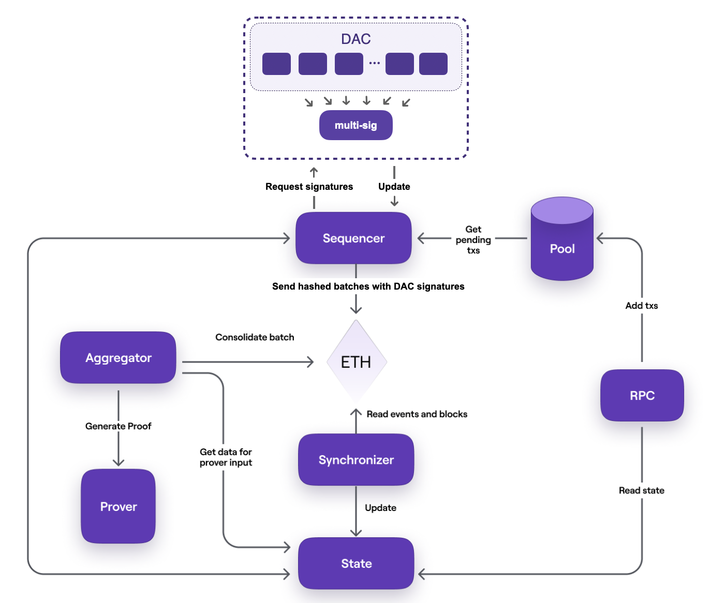

A data availability committee (DAC) is an offchain network of nodes that provides data to a blockchain network. The advantages are:

- **Lower transaction fees**: Reduced computational requirements lead to lower fees.
- **State privacy**: A secure copy of state transitions ensures data integrity and privacy.

DACs store the data required to reconstruct the state of the blockchain and make that data accessible so that, if the blockchain goes down, users can still access their assets and data.

Delegating blockchain data to a DAC in this way can be costly. However, a DAC improves finality and thus supports Enterprise use cases which require cheap and fast transactions with a private and secure data layer.

The CDK validium DAC is a secure consortium of nodes that ensures off-chain data access. 

## DAC data flow

The DAC works together with the sequencer to control the flow of data. The process can be broken down as follows:

1. **Batch formation**: The sequencer collects user transactions and organizes them into batches.

2. **Batch authentication**: Once the batches are assembled, they are authenticated. The sequencer forwards the batch data and its corresponding hash to the DAC.

3. **Data validation and storage**:  The DAC nodes independently validate the batch data. Once validated, the hash is stored in each node's local database for future reference.

4. **Signature generation**: Each DAC node generates a signature for the batch hash. This serves as an endorsement of the batch's integrity and authenticity.

5. **Communication with Ethereum**: The sequencer collects the DAC members' signatures and the original batch hash and submits them to the Ethereum network for verification.

6. **Verification on Ethereum**: A designated smart contract on Ethereum verifies the submitted signatures against a list of valid DAC members and confirms that sufficient approval has been provided for the batch hash.

7. **Final settlement with zero-knowledge proof**: The aggregator prepares a proof for the batch via the prover and submits it to Ethereum. This proof confirms the validity of the batch's transactions without revealing their details. The chain state updates on Ethereum.

