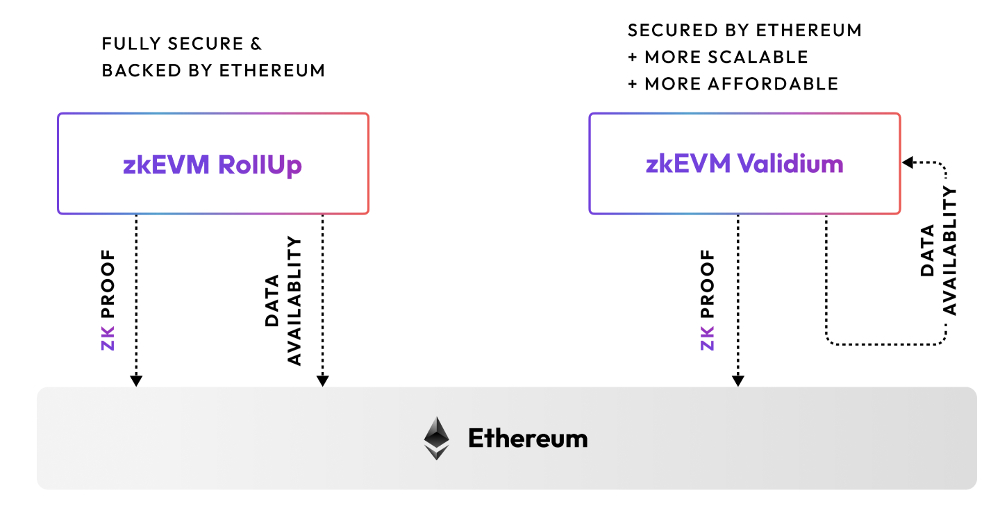

# Rollups vs. validiums

[Layer 2s](./layer2s.md) can differ in how they interact with Ethereum. More specifically, they often differ in what they do with the transaction data (i.e. the information about transactions that occurred on the L2). L2s can be broadly categorized into two types: rollups and validiums.

## Rollups

Rollups use Ethereum as a [data availability](https://docs.polygon.technology/cdk/glossary/#data-availability) (DA) layer, meaning they send and store transaction data directly on Ethereum, by providing it within specific parameters of a transaction submitted to a smart contract on the L1.

Using Ethereum to store transaction data is generally considered the most secure option for DA as it leverages Ethereum's security and decentralization. However, this approach is costly, as the L2 must pay Ethereum&rsquo;s high gas fees for storing data on the L1, which typically results in higher gas fees for users.

Within the rollup category, there are further nuances to storing transaction data on Ethereum. Some rollups post serialized transaction data directly, whereas others post state differences instead. Some rollups use [calldata](https://docs.soliditylang.org/en/v0.8.26/types.html#data-location) to store transaction data, while others use more recent Ethereum features such as Blobs, introduced in [EIP-4844](https://www.eip4844.com/).

The CDK provides full flexibility to developers to choose what to do with transaction data, including the ability to build rollups that store data on Ethereum as a rollup like the Polygon zkEVM.

## Validiums

Validiums do not store transaction data on Ethereum. Instead, they only post ZK-proofs called validity proofs to Ethereum that verify the state of the L2 chain.

As an L2, a validium does not pay high gas fees associated with storing data on Ethereum. This approach is more cost-effective than rollups, meaning gas fees are much lower for users. 

However, validiums are typically considered less secure than rollups, as they store transaction data off of Ethereum using solutions such as a [Data Availability Committee (DAC)](https://docs.polygon.technology/cdk/glossary/#data-availability-committee-dac) or [alternative data availability solutions](#alternative-da-solutions).

### Alternative DA solutions

The CDK supports integration of alternative DA solutions, including solutions such as [Avail DA](https://blog.availproject.org/avail-ecosystem-series-polygon-zkevm-validium/), [Celestia](https://polygon.technology/blog/celestias-high-throughput-out-of-the-box-data-availability-layer-to-integrate-with-polygon-cdk), [Near DA](https://pages.near.org/blog/near-da-integrates-with-polygon-cdk-for-developers-building-ethereum-zk-rollups/) and more.

## What's best for you?

The method you use to store transaction data should be determined by your specific use case. As a general rule of thumb:

- Rollups are more suitable for chains that process high-value transactions where security is the top priority, such as DeFi applications, as they are considered more secure with slightly higher fees and limited throughput.

- Validiums are more suitable for chains that process a high volume of transactions where low transaction fees are the top priority, such as gaming or social applications, as they are considered more scalable and offer low fees.

## Default configuration

By default, chains built with the CDK are set up as a validium. For most use cases, the validium option is the more suitable as it offers lower gas fees and higher throughput, while maintaining strong security guarantees provided by the use of validity proofs.

## Technical comparison

Below is a breakdown of the technical differences between a zkEVM rollup and validium:

|                       | Rollup                                                                                                                                                                                                   | Validium                                                                                                                                                                                                                                                   |
| --------------------- | -------------------------------------------------------------------------------------------------------------------------------------------------------------------------------------------------------- | ---------------------------------------------------------------------------------------------------------------------------------------------------------------------------------------------------------------------------------------------------------- |
| **Node type**         | [zkEVM node](https://github.com/0xPolygonHermez/zkevm-node)                                                                                                                                              | [Validium node](https://github.com/0xPolygon/cdk-validium-node): zkEVM node with validium extensions                                                                                                                                                       |
| **Data availability** | On-chain via L1                                                                                                                                                                                          | Off-chain via a local option, or a [DAC](../glossary/index.md#data-availability-committee-dac) + [DA node](https://github.com/0xPolygon/cdk-data-availability)                                                                                             |
| **Components**        | zkEVM components\*                                                                                                                                                                                       | zkEVM components\* + PostgreSQL database + on-chain committees                                                                                                                                                                                             |
| **Contracts**         | [zkEVM smart contracts](https://github.com/0xPolygonHermez/zkevm-contracts) <ul><li>`PolygonZkEVM` (main rollup contract)</li> <li> `PolygonZkEVMBridge`</li> <li>`PolygonZkEVMGlobalExitRoot`</li></ul> | [Validium-specific DAC contract](https://github.com/0xPolygon/cdk-validium-contracts) <ul><li>`CDKDataCommittee.sol`</li><li> `CDKValidium.sol` </li></ul>                                                                                                 |
| **Infrastructure**    | Standard infrastructure                                                                                                                                                                                  | Dedicated infrastructure for data availability layer and DACs                                                                                                                                                                                              |
| **Tx flow**           | All transaction data is published on L1                                                                                                                                                                  | Validium only publishes the hash of the transaction data to L1. The sequencer sends both the hash and the transaction data to the DAC for verification. Once approved, the hash+signatures are sent to the Consensus L1 contract of the validium protocol. |
| **Security**          | High security due to on-chain data availability and zero-knowledge proofs.                                                                                                                               | Off-chain data availability can affect security if the sequencer goes offline or if DAC members collude to withhold state data.                                                                                                                            |
| **Gas fees**          | High, because all transaction data is stored on Ethereum.                                                                                                                                                | Low, because only the hash of the transaction data is stored on Ethereum.                                                                                                                                                                                  |
| **Proof generation**  | Uses Prover to generate proofs of batched transactions for validation.                                                                                                                                   | Uses Prover to generate proofs of batched transactions for validation.                                                                                                                                                                                     |
| **Final settlement**  | Transaction batches and their corresponding proofs are added to the Ethereum state.                                                                                                                      | The hash of transaction data and its proof are added to the Ethereum state, referred to as the consolidated state.                                                                                                                                         |

\*JSON RPC, Pool DB, Sequencer, Etherman, Synchronizer, State DB, Aggregator, Prover

## Further reading

- [Ethereum documentation: rollups](https://ethereum.org/en/developers/docs/scaling/#rollups)
- [Ethereum documentation: validiums](https://ethereum.org/en/developers/docs/scaling/validium/)
