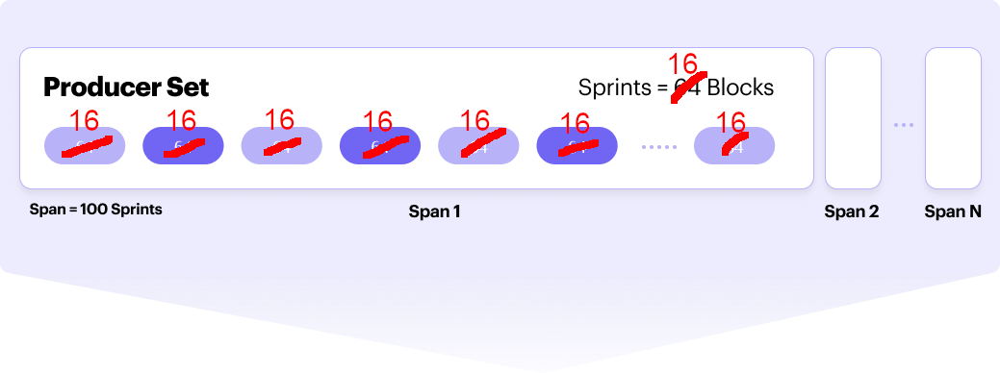

Bor is our Block producer layer, which, in sync with the Heimdall validator, selects the producers and verifiers for each span and sprint.

The Bor node or the Block Producer implementation is basically the EVM-compatible blockchain operator. Currently, it is a Geth implementation with custom changes done to the consensus algorithm.

Polygon PoS uses dual-consensus architecture on the Polygon Network to optimise for speed and decentralisation.

## Polygon Chain

This chain is a separate blockchain that is attached to Ethereum using a two-way peg. The two-way peg enables the interchangeability of assets between Ethereum and Polygon.

## EVM Compatible VM

The Ethereum Virtual Machine (EVM) is a powerful, sandboxed virtual stack embedded within each full Polygon node, responsible for executing contract bytecode. Contracts are typically written in high-level languages, like Solidity, then compiled to EVM bytecode.

## Proposers and Producers Selection

Block Producers for the Bor layer are a committee selected from the Validator pool on the basis of their stake, which happens at regular intervals and is shuffled periodically. These intervals are decided by the Validator's governance with regard to dynasty and network.

The ratio of Stake/Staking power specifies the probability to be selected as a member of the block producer committee.

#### Selection Process

1. Validators are given slots proportionally according to their stake.
2. Using historical Ethereum block data as seed, we shuffle this array.
3. Now depending on Producer count*(maintained by validator's governance)*, validators are taken from the top.
4. Using this validator set and Tendermint's proposer selection algorithm, we choose a producer for every sprint on Bor.
