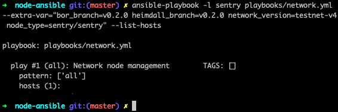

An [Ansible playbook](https://docs.ansible.com/ansible/latest/user_guide/playbooks_intro.html) is used to
configure and manage a full node. 

## Prerequisites

- Install Ansible on your local machine with Python3.x. The setup will not work if you have Python2.x.
    - To install Ansible with Python 3.x, you can use pip. If you do not have pip on your machine,
      follow the steps outlined [here](https://pip.pypa.io/en/stable/). Run `pip3 install ansible` to install
      Ansible.
- Check the [Polygon PoS Ansible repository](https://github.com/maticnetwork/node-ansible#requirements) for
  requirements.
- You will also need to ensure that Go is **not installed** in your environment. You will run into issues if you attempt to set up your full node through Ansible with Go installed as Ansible requires specific packages of Go to be installed.
- You will also need to make sure that your VM / Machine does not have any previous setups for Polygon Validator or Heimdall or Bor. You will need to delete them as your setup will run into issues.

!!!info
    Heimdall source enhancements

    The latest Heimdall version, **[v1.0.3](https://github.com/maticnetwork/heimdall/releases/tag/v1.0.3)**, contains a few enhancements.
    The delay time between the contract events of different validators **has been increased** to ensure that the mempool doesn't get filled quickly in case of a burst of events that could hamper the chain's progress.

    Additionally, the data size **has been restricted in state sync txs to 30Kb (when represented in bytes) and 60Kb (when defined as string)**.

    For example:

    ```bash
    Data - "abcd1234"
    Length in string format - 8
    Hex Byte representation - [171 205 18 52]
    Length in byte format - 4
    ```
    

## Full node setup

- Ensure you have access to the remote machine or VM on which the full node is being set up.
  > Refer to [https://github.com/maticnetwork/node-ansible#setup](https://github.com/maticnetwork/node-ansible#setup) for more details.
- Clone the [https://github.com/maticnetwork/node-ansible](https://github.com/maticnetwork/node-ansible) repository.
- Navigate into the node-ansible folder: `cd node-ansible`
- Edit the `inventory.yml` file and insert your IP(s) in the `sentry->hosts` section.
  > Refer to [https://github.com/maticnetwork/node-ansible#inventory](https://github.com/maticnetwork/node-ansible#inventory) for more details.
- Check if the remote machine is reachable by running: `ansible sentry -m ping`
- To test if the correct machine is configured, run the following command:

  ```bash
  # Mainnet:
  ansible-playbook playbooks/network.yml --extra-var="bor_version=v1.0.0 heimdall_version=v1.0.3 network=mainnet node_type=sentry" --list-hosts

  # Testnet:
  ansible-playbook playbooks/network.yml --extra-var="bor_version=v1.1.0 heimdall_version=v1.0.3 network=mumbai node_type=sentry" --list-hosts
  ```



- Next, set up the full node with this command:

  ```bash
  # Mainnet:
  ansible-playbook playbooks/network.yml --extra-var="bor_version=v1.1.0 heimdall_version=v1.0.3 network=mainnet node_type=sentry"

  # Testnet:
  ansible-playbook playbooks/network.yml --extra-var="bor_version=v1.0.0 heimdall_version=v1.0.3 network=mumbai node_type=sentry"
  ```

- In case you run into any issues, delete and clean the whole setup using:
  ```
  ansible-playbook playbooks/clean.yml
  ```

- Once you initiate the Ansible playbook, log in to the remote machine.

- Please **ensure that the value of seeds and bootnodes mentioned below is the same value as mentioned in Heimdall and Bor `config.toml` files**. If not, change the values accordingly.

  - Heimdall seed nodes:

    ```bash
    moniker=<enter unique identifier>

    # Mainnet:
    seeds="1500161dd491b67fb1ac81868952be49e2509c9f@52.78.36.216:26656,dd4a3f1750af5765266231b9d8ac764599921736@3.36.224.80:26656,8ea4f592ad6cc38d7532aff418d1fb97052463af@34.240.245.39:26656,e772e1fb8c3492a9570a377a5eafdb1dc53cd778@54.194.245.5:26656,6726b826df45ac8e9afb4bdb2469c7771bd797f1@52.209.21.164:26656"

    # Testnet:
    seeds="9df7ae4bf9b996c0e3436ed4cd3050dbc5742a28@43.200.206.40:26656,d9275750bc877b0276c374307f0fd7eae1d71e35@54.216.248.9:26656,1a3258eb2b69b235d4749cf9266a94567d6c0199@52.214.83.78:26656"
    ```
  
!!! tip
    The following heimdall seed can be used for both mainnet and Mumbai testnet: `8542cd7e6bf9d260fef543bc49e59be5a3fa9074@seed.publicnode.com:27656`

  - Bootnodes:

    ```bash
    # Mainnet:
    bootnode ["enode://b8f1cc9c5d4403703fbf377116469667d2b1823c0daf16b7250aa576bacf399e42c3930ccfcb02c5df6879565a2b8931335565f0e8d3f8e72385ecf4a4bf160a@3.36.224.80:30303", "enode://8729e0c825f3d9cad382555f3e46dcff21af323e89025a0e6312df541f4a9e73abfa562d64906f5e59c51fe6f0501b3e61b07979606c56329c020ed739910759@54.194.245.5:30303"]

    # Testnet:
    bootnodes ["enode://bdcd4786a616a853b8a041f53496d853c68d99d54ff305615cd91c03cd56895e0a7f6e9f35dbf89131044e2114a9a782b792b5661e3aff07faf125a98606a071@43.200.206.40:30303", "enode://209aaf7ed549cf4a5700fd833da25413f80a1248bd3aa7fe2a87203e3f7b236dd729579e5c8df61c97bf508281bae4969d6de76a7393bcbd04a0af70270333b3@54.216.248.9:30303"]
    ```

- To check if Heimdall is synced
    - On the remote machine/VM, run `curl localhost:26657/status`
    - In the output, `catching_up` value should be `false`

- Once Heimdall is synced, run
    - `sudo service bor start`

You have successfully set up a full node with Ansible.

!!!note
    
    If Bor presents an error of permission to data, run this command to make the Bor user the owner of the Bor files:

    ```bash
    sudo chown bor /var/lib/bor
    ```

## Logs

Logs can be managed by the `journalctl` linux tool. Here is a tutorial for advanced usage: [How To Use Journalctl to View and Manipulate Systemd Logs](https://www.digitalocean.com/community/tutorials/how-to-use-journalctl-to-view-and-manipulate-systemd-logs).

**Check Heimdall node logs**

```bash
journalctl -u heimdalld.service -f
```

**Check Bor Rest-server logs**

```bash
journalctl -u bor.service -f
```

## Ports and Firewall Setup

Open ports 22, 26656 and 30303 to world (0.0.0.0/0) on sentry node firewall.

You can use VPN to restrict access for port 22 as per your requirement and security guidelines.
