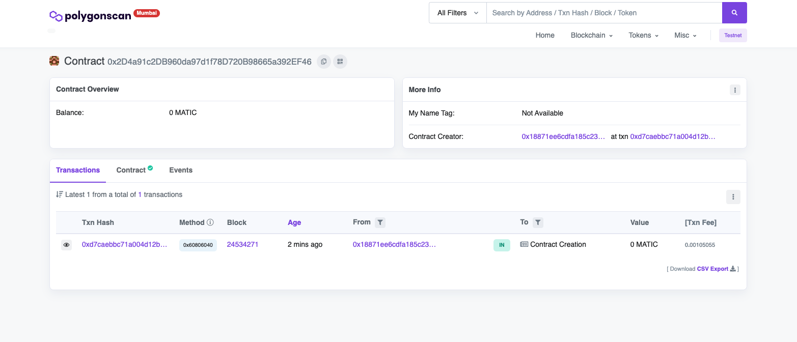

!!! warning "Third-party content"

    Polygon technical documentation may contain third-party content, including websites, products, and services, that are provided for informational purposes only.

    Polygon Labs does not endorse, warrant, or make any representations regarding the accuracy, quality, reliability, or legality of any third-party websites, products, or services. If you decide to access any third-party content, you do so entirely at your own risk and subject to the terms and conditions of use for such websites. Polygon Labs reserves the right to withdraw such references and links without notice.

    Polygon technical documentation serves as an industry public good and is made available under the [MIT License](https://opensource.org/license/mit/). In addition, please view the official [Polygon Labs Terms of Use](https://polygon.technology/terms-of-use).

Python is one of the most versatile programming languages; from researchers running their test models to developers using it in heavy production environments, it has use cases in every possible technical field.

In this tutorial, you will learn how to use [Brownie](https://eth-brownie.readthedocs.io/en/latest/index.html#brownie) framework to write and deploy a smart contract by leveraging [QuickNode](https://www.quicknode.com/chains/matic?utm_source=polygon_docs&utm_campaign=ploygon_docs_contract_guide) testnet nodes for Polygon.

!!! tip

    To contact the Quicknode team, send them a message or tag them on Twitter [@QuickNode](https://twitter.com/QuickNode).

## Prerequisites

- Python3 installed
- A Polygon node
- Code editor
- Command line interface

## What you will do

1. Set up Brownie
2. Get access to Quicknode test nodes
3. Compile and Deploy a smart contract
4. Check the deployed contract data

## What is Brownie?

Smart contract development is majorly dominated by JavaScript-based libraries like [web3.js](https://web3js.readthedocs.io/), [ethers.js](https://docs.ethers.io/), [Truffle](https://www.trufflesuite.com/docs/truffle/), and [Hardhat](https://hardhat.org/). Python is a versatile, highly used language and can also be used for smart contracts / Web3 development; [web3.py](https://web3py.readthedocs.io/en/stable/) is a compelling Python library that fulfills Web3 needs. Brownie framework is built on top of `web3.py`.

[Brownie](https://eth-brownie.readthedocs.io/en/latest/index.html#brownie) is a Python-based framework to develop and test smart contracts. Brownie has support for both Solidity and Vyper contracts, and it even provides contract testing via [pytest](https://github.com/pytest-dev/pytest).

To demonstrate the process of writing and deploying a smart contract with Brownie, we will use [Brownie-mixes](https://github.com/brownie-mix) which are template projects. Specifically, we will use a [token mix](https://github.com/brownie-mix/token-mix), which is a template of the ERC-20 implementation.

## Install dependencies

Brownie is built on top of python3, so we need it installed to work with Brownie. Let us check if we have python3 installed on our system. To do so, type the following in your command line tool:

```bash
python3 -V
```

This should return the version of python3 installed. If not installed, download and install it from the official [Python website](https://www.python.org/downloads/).

Let us make a project directory before installing Brownie, and make that project directory our current working directory:

```bash
mkdir brownieDemo
cd brownieDemo
```

Now that you have installed python3 on your system, let us install Brownie using pip, Python's package manager. Pip is similar to what npm is for JavaScript. Type the following in your command line:

```bash
pip3 install eth-brownie
```

!!! tip

    If the install fails, you can use the following command instead: `sudo pip3 install eth-brownie`

To check if Brownie was installed correctly, type `brownie` in your command line, and it should give the following )

To get the token mix, simply type the following in your command line:

```
brownie bake token
```

This will create a new directory `token/` in our `brownieDemo` directory.

### File structure

First of all, navigate to the `token` directory:

```bash
cd token
```

Now, open the `token` directory in your text editor. Under the `contracts/` folder you will find `Token.sol`, which is our main contract. You can write your own contracts or modify `Token.sol` file.

Under the `scripts/` folder, you will find `token.py` Python script. This script will be used to deploy the contract, and modifications are needed based on contracts.


The contract is an ERC-20 contract. You can learn more about the ERC-20 standards and contracts in this [guide on ERC-20 tokens](https://www.quicknode.com/guides/solidity/how-to-create-and-deploy-an-erc20-token).

## Booting your Polygon node

QuickNode has a global network of Polygon Mainnet and Mumbai testnet nodes. They also run a [free public Polygon RPC](https://docs.polygon.technology/docs/operate/network/#:~:text=https%3A//rpc%2Dmainnet.matic.quiknode.pro) but if you get rate limited, you can sign up for a [free trial node from QuickNode](https://www.quicknode.com/chains/matic?utm_source=polygon_docs&utm_campaign=ploygon_docs_contract_guide).


Copy the **HTTP URL**, which will be useful later in the tutorial.

## Network and account setup

We need to set up our QuickNode endpoint with Brownie. To do so, type the following in your command line:

```
brownie networks add Ethereum matic_mumbai host=YOUR_QUICKNODE_URL chainid=3
```

Replace `YOUR_QUICKNODE_URL` with the **Mumbai Testnet HTTP URL** that we just received while booting our Polygon node.

In the above command, `Ethereum` is the name of the environment, and `matic_mumbai` is the custom name of the network; you can give any name to your custom network.

The next thing we need to do here is to create a new wallet using Brownie, to do so type the following in your command line:

```
brownie accounts generate testac
```

You will be asked to set up a password for your account! After completing the steps, this will generate an account along with a mnemonic phrase, save it offline. The name `testac` is the name for our account (You can choose any name that you like).


!!! note

    Mnemonic phrases can be used to recover an account or import the account to other [non-custodial wallets](https://www.quicknode.com/guides/web3-sdks/how-to-do-a-non-custodial-transaction-with-quicknode). The account you see in the image above was just created for this guide.

Copy the account address so that we can get some test MATIC, which will be required to deploy our contract.

## Getting Testnet MATIC

We will need some test MATIC tokens to pay for gas fees to deploy our smart contract.

Copy the address of your account which we generated in this tutorial, paste it into the address field of [Polygon faucet](https://faucet.polygon.technology/), and click on **Submit**. The faucet will send you 0.2 test MATIC.


## Deploying your Smart Contract

Before deploying the contract, you need to compile it using:

```
brownie compile
```


Now open the `scripts/token.py` in your text editor, and make the following changes:

```python
#!/usr/bin/python3
from brownie import Token, accounts

def main():
    acct = accounts.load('testac')
    return Token.deploy("Test Token", "TST", 18, 1e21, {'from': acct})
```

!!!info "Explanation"

    Using the above code, we have imported `testac` account which we created earlier, and stored it in `acct` variable. Also, in the next line, we have edited `'from':` part to receive data from `acct` variable.

Finally, we will deploy our smart contract:

```
brownie run token.py --network matic_mumbai
```

`matic_mumbai` is the name of the custom network which we created earlier. The prompt will ask you for the **password** that we set earlier while making the account.

After running the above command, you must get the transaction hash, and Brownie will wait for the transaction to get confirmed. Once the transaction is confirmed, it will return the address at which our contract is deployed on the Polygon Mumbai testnet.


You can check out the deployed contract by copy-pasting the contract address at [Polygonscan Mumbai](https://mumbai.polygonscan.com/).



## Testing the Contract

Brownie also offers the option of testing smart contracts functionalities. It uses the `pytest` framework to easily generate unit tests. You can find more information about writing tests on Bronwnie [on their documentation](https://eth-brownie.readthedocs.io/en/latest/tests-pytest-intro.html#).

**This is how contracts are deployed on Polygon using Brownie and QuickNode.**

QuickNode, just like Polygon, has always had an education-first approach providing developer [guides](https://www.quicknode.com/guides?utm_source=polygon_docs&utm_campaign=ploygon_docs_contract_guide), [docs](https://www.quicknode.com/docs/polygon?utm_source=polygon_docs&utm_campaign=ploygon_docs_contract_guide), [tutorial videos](https://www.youtube.com/channel/UC3lhedwc0EISreYiYtQ-Gjg/videos) and a [community of Web3 developers](https://discord.gg/DkdgEqE) who are eager to help each other.
