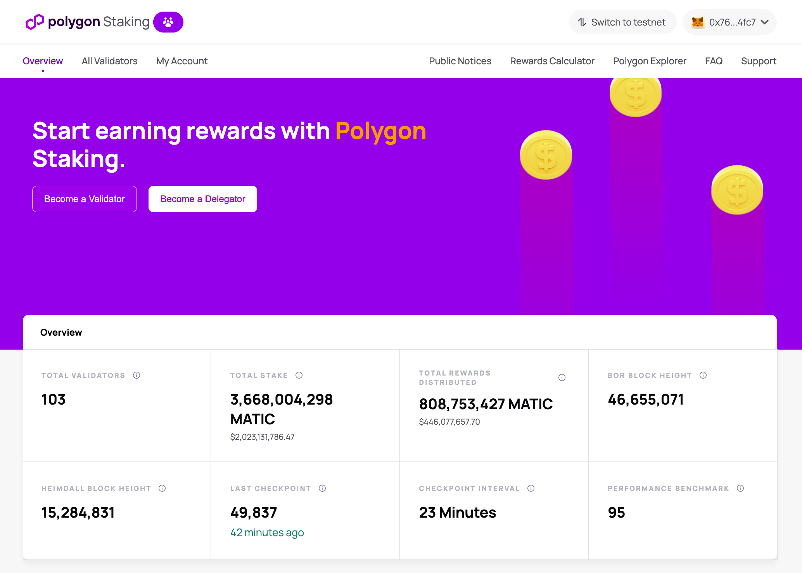
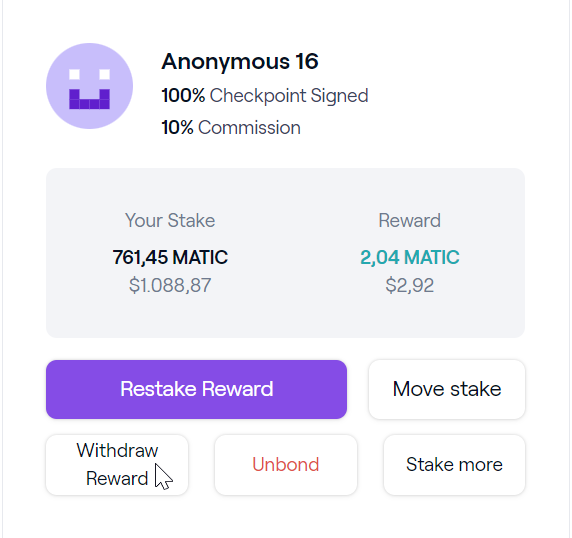
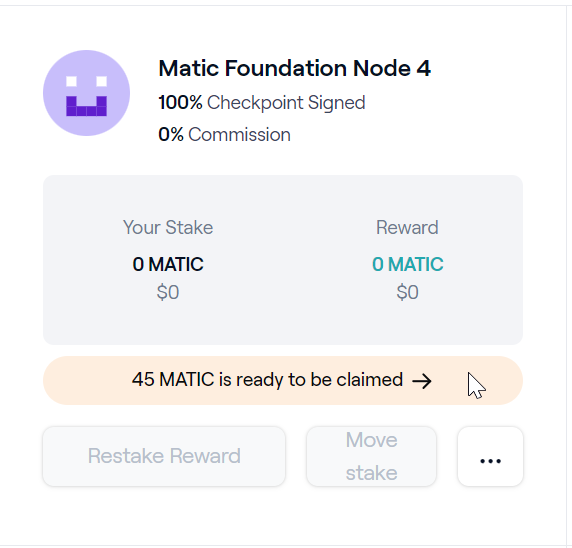

### How to stake tokens on Polygon?

For Staking you would need to have funds on the Ethereum Mainnet (more information [here](https://etherscan.io/gastracker)). Log into your wallet on the Ethereum network using the Staking Dashboard. https://staking.polygon.technology/

Please watch this video for a graphical illustration of how this works:

<video loop width="100%" height="100%" controls="true" >
  <source type="video/mp4" src="../../../../img/pos/staking.mp4"></source>
  
Your browser does not support the video element.

</video>

### I've staked my Matic tokens. How can I stake more?
You can navigate to "Your Delegations", choose one of the stakes and click on "Stake More".

Please watch this video for a graphical illustration of how this works:

<video loop width="100%" height="100%" controls="true" >
  <source type="video/mp4" src="../../../../img/pos/staking-more.mov"></source>
  
Your browser does not support the video element.

</video>

<!-- 
<video width="70%" height="70%" controls="true" >
  <source type="video/mp4" src="../../../../img/pos/staking-more.mov"></source>
  
Your browser does not support the video element.

</video> -->

### Why am I not able to stake?

Check if you have funds on the Main Ethereum Network, to delegate your tokens. All staking happens on the Ethereum Network only.

### I am unable to view the staking tab. How do I access staking?

You just need to access **https://staking.polygon.technology/**, where you will see the following landing page:

### How do I know which validator to select for better rewards?

It depends on your understanding and research on which validator you would want to stake on. You can find the list of validators here : https://staking.polygon.technology/validators

### How to unbond?

To unbond from a validator, navigate to MyAccount, where you find **Your Delegations**.
There you will see an **Unbond** button for each of the validators. Click on the **Unbond** button for whichever validator that you want to unbond from.

Please watch the video for a graphical illustration of how this works:

<video loop width="100%" height="100%" controls="true" >
  <source type="video/mp4" src="../../../../img/pos/unbond.mp4"></source>
  
Your browser does not support the video element.

</video>

### What is the unbonding period?

The unbonding period on Polygon is 80 checkpoints. Every checkpoint takes approximately 30 minutes. However, some checkpoints could be delayed due to congestion on Ethereum.
This period applies to the originally delegated amount and re-delegated amounts. It does not apply to any rewards that were not re-delegated.

### How to restake rewards?

Go to **My Account** to check **Your Delegations**.
Clicking on **Restake Reward** will ask you for confirmation from your wallet account. Once you confirm the transaction, only then the restake transaction would be complete.

`Step 1` 
  

  
  

`Step 2`  
  

  
  

Please watch the video for a graphical illustration of how this works:

<video width="100%" height="100%" controls="true" >
  <source type="video/mp4" src="../../../../img/pos/restake.mp4"></source>
  
Your browser does not support the video element.

</video>

### I want to restake rewards but I am unable to.

You would need to have a minimum of **2 Matic** to restake rewards.

### How to withdraw rewards?

You can claim your rewards by clicking on the **My Account**, all the delegators for a validator are displayed. Click on the **Withdraw Reward** button and the rewards will be transferred to your delegated account in wallet.

`Step 1`  

  

`Step 2`  

  

Please watch the video for a graphical illustration of how this works:

<video width="100%" height="100%" controls="true" >
  <source type="video/mp4" src="../../../../img/pos/claim-rewards.mp4"></source>
  
Your browser does not support the video element.

</video>

### I want to withdraw rewards but I am unable to.

You would need to have a minimum of **2 Matic** to withdraw rewards.

### How to claim stake?

Once the unbonding period is complete, the **Claim Stake** button will be enabled and you can then claim your staked tokens. The tokens will be transferred to your account.

`Step 1`  

  

`Step 2`  

  

`Step 3`  

  

Please watch the video for a graphical illustration of how this works:

<video width="100%" height="100%" controls="true" >
  <source type="video/mp4" src="../../../../img/pos/claiming-stake.mov"></source>
  
Your browser does not support the video element.

</video>

### Are hardware wallets supported?

Yes, hardware wallets are supported. You can use the **Connect Hardware Wallet** option on MetaMask and connect your Hardware wallet and then continue the delegation process.

### Why can’t I stake directly from Binance?

Staking through Binance is not yet supported. There will be an announcement if and when Binance starts supporting it.

### Do I need to deposit Matic to the Polygon mainnet network for staking?
No. All your funds need to be on the Ethereum mainnet.

### When do rewards get distributed?

The rewards are distributed whenever a checkpoint is submitted.

Approximately 71795 Matic tokens are distributed proportionately on each successful checkpoint submission to each delegator based on their stake relative to the overall staking pool of all validators and delegators. Also, the percentage for the reward distributed to each delegator will vary with each checkpoint depending on the relative stake of the delegator, validator and the overall stake.

(Note that there is a 10% proposer bonus that accrues to the validator who submits the checkpoint, but over time, the effect of the extra bonus is nullified over multiple checkpoints by different validators.)

The checkpoint submission is done by one of the validators approximately every 30 minutes. This time may vary based on validator consensus on the Polygon Heimdall layer. This may also vary based on the Ethereum Network. Higher congestion in the network may result in delayed checkpoints.

You can track checkpoints on the staking contract here: https://etherscan.io/address/0x86e4dc95c7fbdbf52e33d563bbdb00823894c287

### Why do rewards keep getting decreased at every checkpoint?

Rewards earned will depend on the actual total locked supply in the network at each checkpoint. This is expected to vary significantly as more MATIC tokens get locked in the staking contracts.
Rewards will be higher, to begin with, and will keep decreasing as the locked supply percentage goes up. This change in locked supply is captured at every checkpoint, and rewards are calculated based on this.

### Will I keep receiving rewards after I unbond?

No. Once you unbond you stop receiving rewards.

### Can I move the stake to another validator?
 Yes, you just have to reach "Your Delegations", click on "Move Stake", and then choose your new validator.

Please watch the video for a graphical illustration of how this works:

<video width="100%" height="100%" controls="true" >
  <source type="video/mp4" src="../../../../img/pos/moving.mp4"></source>
  
Your browser does not support the video element.

</video>

### Which browsers are compatible with the staking dashboard?

Chrome, Firefox, and Brave.

### Nothing happens when I try to log in or my MetaMask is stuck at confirming after logging in. What do I do?

Check for the following:
- If you’re using Brave, please turn off the option for **Use Crypto Wallets** in the settings panel.
- Check if you are logged into Metamask.
- Check if you are logged into MetaMask with Trezor/Ledger. You need to additionally turn on permission to call contracts on your Ledger device, if not enabled already.
- Check your system timestamp. If the system time is not correct, you will need to correct it.