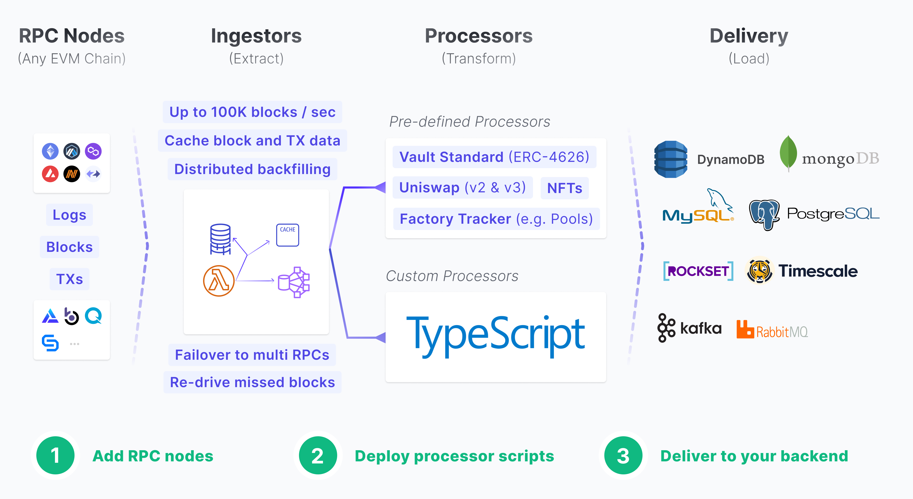

!!! note "Content disclaimer"   

    Please view the third-party content disclaimer [<ins>here</ins>](https://github.com/0xPolygon/wiki/blob/master/CONTENT_DISCLAIMER.md).

Real-time and historical custom data indexing for any evm chain.

[Flair](https://flair.dev) offers reusable **indexing primitives** (such as fault-tolerant RPC ingestors, custom processors, re-org aware database integrations) to make it easy to receive, transform, store and access your on-chain data.



## Why Flair?

Compared to other alternatives the main reasons are:

* 🚀  Adopting **parallel and distributed processing** paradigm means high scalability and resiliency for your indexing stack. Instead of constrained sequential processing (e.g Subgraph).
* 🧩  Focused on **primitives**, which means on the left you plug-in an RPC and on the right you output the data to any destination database.
* 🚄  Native **real-time stream processing** for certain data workload (such as aggregations, rollups) for things like total volume per pool, or total portfolio per user wallet.
* ☁️  **Managed** cloud services avoid DevOps and irrelevant engineering costs for dApp developers.
* 🧑‍💻  Avoid decentralization **overhead** (consensus, network hops, etc) since we believe to enable best UX for dApps reading data must be as close to the developers as possible.
### Features

* ✅ Listen to **any EVM chain** with just an RPC URL.
  * Free managed RPC URLs for +8 popular chains already included.
  * Works with both websocket and https-only RPCs.
* ✅ Track and ingest **any contract** for **any event topic.**
  * Auto-track new contracts deployed from factory contracts.
* ✅ **Custom processor scripts** with Javascript runtime (with **Typescript** support)
  * Make external API or Webhook calls to third-party or your backend.
  * Get current or historical USD value of any ERC20 token amount of any contract address on any chain.
  * Use any external NPM library.
* ✅ **Stream** any stored data to your destination database (Postgres, MongoDB, MySQL, Kafka, Elasticsearch, Timescale, etc).

## Getting started

1️⃣ Clone the [starter boilerplate](https://github.com/flair-sdk/starter-boilerplate) template and follow the instructions

```bash
git clone https://github.com/flair-sdk/starter-boilerplate.git
# ... follow instructions in README.md
```
!!! info

    Boilerplate instructions will create a **new cluster**, generate **an API Key**, and set up a manifest.yml to index your **first contract** with **sample custom processor** scripts.

    Learn more about the [structure of manifest.yml](https://docs.flair.dev/reference/manifest.yml).

2️⃣ Configure Polygon RPC nodes

Set a unique namespace, Polygon chainId and RPC endpoint in your config. Remember that you can add up to 10 RPC endpoints for resiliency.

```yaml
{
  "cluster": "dev",
  "namespace": "my-awesome-polygon-indexing-dev",
  "indexers": [
    {
      "chainId": 137,
      "enabled": true,
      "ingestionFilterGroup": "default",
      "processingFilterGroup": "default",
      "sources": [
        # Highly-recommended to have at least 1 websocket endpoint
        "wss://rpc-mainnet.matic.network",
        # You can put multiple endpoints for failover
        "https://polygon-rpc.com/"
      ]
    }
  ]
}
```

3️⃣  Sync some historical data using [backfill command](https://docs.flair.dev/reference/backfilling). Remember that `enabled: true` flag in your `config` enabled your indexer to capture data in real-time already.

```bash
# backfill certain contracts or block ranges
pnpm flair backfill --chain 137 --address
0x06c9823460b76acf26a9af2acfdcac0d03ca6555  -d backward --max-blocks 10000

# backfill for a specific block number, if you have certain events you wanna test with
pnpm flair backfill --chain 137 -b 47807770

# backfill for the recent data in the last X minute
pnpm flair backfill --chain 137 --min-timestamp="30 mins ago" -d backward
```


4️⃣ [Query](https://docs.flair.dev/#getting-started) your custom indexed data.

5️⃣ Stream the data to your [own database](https://docs.flair.dev/reference/database#your-own-database).

## Examples

Explore real-world usage of Flair indexing primitives for various use-cases.

### DeFi

* [Aggregate protocol fees in USD across multiple chains](https://github.com/flair-sdk/examples/tree/main/aggregate-protocol-fees-in-usd).
* [Calculate "Health Factor" of positions with contract factory tracking](https://github.com/flair-sdk/examples/tree/main/health-factor-with-factory-tracking).
* [Index Uniswap v2 swaps with USD price for all addresses](https://github.com/flair-sdk/examples/tree/main/uniswap-v2-events-from-all-contracts-with-usd-price).

### NFT

* [Index ERC721 and ERC1155 NFTs on any EVM chain with an RPC URL](https://github.com/flair-sdk/examples/tree/main/erc721-and-erc1155-nft-indexing).

## Need help?

[Our engineers](https://docs.flair.dev/talk-to-an-engineer) are available to help you at any stage.