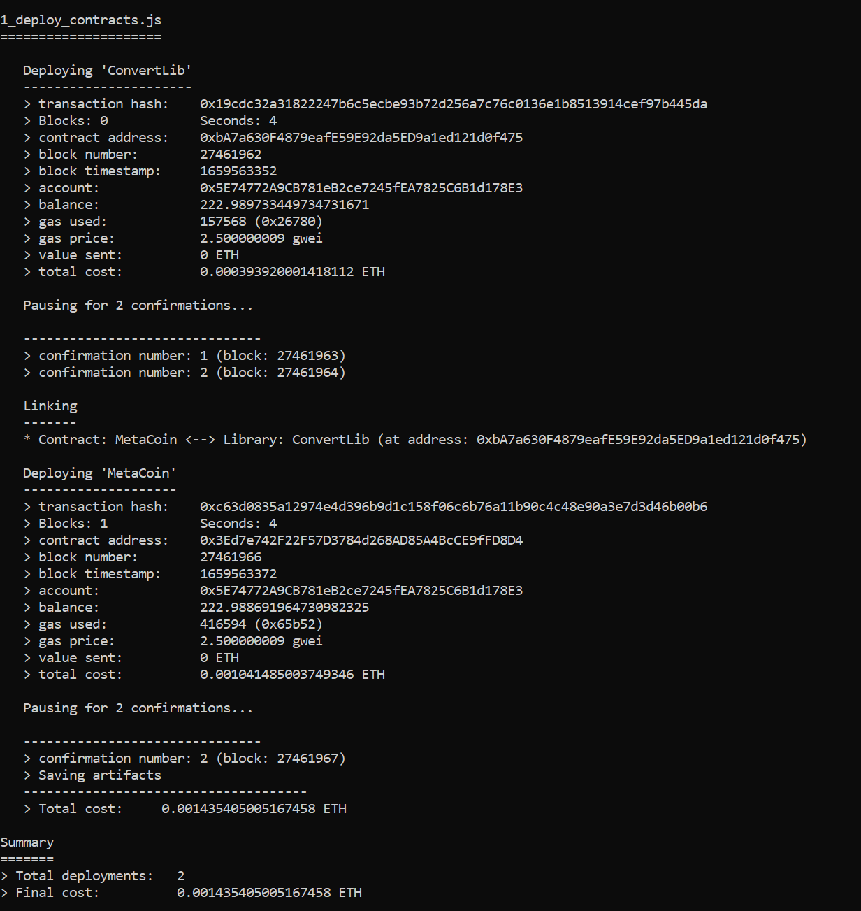

## Overview

[Truffle](https://trufflesuite.com/) is a blockchain development environment, which you can use to create and test smart contracts by leveraging the Ethereum Virtual Machine. This guide aims at teaching how to create a smart contract using Truffle and deploying it on the EVM-compatible Polygon Network.

!!! note

    This tutorial is an adapted version of the [Truffle quickstart guide](https://www.trufflesuite.com/docs/truffle/quickstart) article.

## What you will do

- Install and set up Truffle.
- Deploy a contract on the Polygon Network.
- Check the deployment status on Polygonscan.

## Prerequisites

There are a few technical requirements before we start. Please install the following:

- [Node.js v8+ LTS and npm](https://nodejs.org/en/) (packaged with Node)
- [Git](https://git-scm.com/)

Once we have those installed, we only need one command to install Truffle:

```sh
npm install -g truffle
```

To verify that Truffle is installed properly, type `truffle version` on a terminal. If you see an error, make sure that the npm modules are added to your path.

## Creating a project

### MetaCoin project

We will use one of Truffle's boilerplates which you can find on their [Truffle Boxes](https://trufflesuite.com/boxes/) page. [MetaCoin box](https://trufflesuite.com/boxes/metacoin/) creates a token that can be transferred between accounts.

1. Start by creating a new directory for this Truffle project:

    ```bash
    mkdir MetaCoin
    cd MetaCoin
    ```

2. Download the MetaCoin box:

    ```bash
    truffle unbox metacoin
    ```

With that last step, you have created a Truffle project containing folders with contracts, deployment, testing, and configuration files.

This is the smart contract data from the `metacoin.sol` file:

```solidity title="metacoin.sol"
// SPDX-License-Identifier: MIT
// Tells the Solidity compiler to compile only from v0.8.13 to v0.9.0
pragma solidity ^0.8.13;

import "./ConvertLib.sol";

// This is just a simple example of a coin-like contract.
// It is not ERC20 compatible and cannot be expected to talk to other
// coin/token contracts.

contract MetaCoin {
 mapping (address => uint) balances;

 event Transfer(address indexed _from, address indexed _to, uint256 _value);

 constructor() {
  balances[tx.origin] = 10000;
 }

 function sendCoin(address receiver, uint amount) public returns(bool sufficient) {
  if (balances[msg.sender] < amount) return false;
  balances[msg.sender] -= amount;
  balances[receiver] += amount;
  emit Transfer(msg.sender, receiver, amount);
  return true;
 }

 function getBalanceInEth(address addr) public view returns(uint){
  return ConvertLib.convert(getBalance(addr),2);
 }

 function getBalance(address addr) public view returns(uint) {
  return balances[addr];
 }
}
```

!!! note

    Notice that ConvertLib is being imported just after the `pragma` statement. In this project, there are actually two smart contracts that will be deployed at the end: one is Metacoin, containing all the send and balance logic; the other is ConvertLib, a library used to convert values.

### Testing the contract

You can run Solidity and Javascript tests.

1. In a terminal, run the Solidity test:

    ```bash
    truffle test ./test/TestMetaCoin.sol
    ```

    You should see the following output:

    

2. Run the JavaScript test:

    ```bash
    truffle test ./test/metacoin.js
    ```

    You should see the following output:

    

### Compiling the contract

Compile the smart contract using the following command:

```bash
truffle compile
```

You will see the following output:


### Configuring the smart contract

Before actually depolying the contract, you need to set up the `truffle-config.js` file, inserting network and compilers data.

Go to `truffle-config.js` and update the file with Polygon Mumbai network details.

```js title="truffle-config.js"
const HDWalletProvider = require('@truffle/hdwallet-provider');
const fs = require('fs');
const mnemonic = fs.readFileSync(".secret").toString().trim();

module.exports = {
  networks: {
    development: {
      host: "127.0.0.1",     // Localhost (default: none)
      port: 8545,            // Standard Ethereum port (default: none)
      network_id: "*",       // Any network (default: none)
    },
    matic: {
      provider: () => new HDWalletProvider(mnemonic, `https://rpc-mumbai.maticvigil.com`),
      network_id: 80001,
      confirmations: 2,
      timeoutBlocks: 200,
      skipDryRun: true
    },
  },

  // Set default mocha options here, use special reporters etc.
  mocha: {
    // timeout: 100000
  },

  // Configure your compilers
  compilers: {
    solc: {
        version: "0.8.13",
    }
  }
}
```

Note that it requires mnemonic to be passed in for `maticProvider`. This is the seed phrase (or private key) for the account you would like to deploy from. Create a new `.secret` file in the root directory and enter your 12-word mnemonic seed phrase to get started. To get the seed words from MetaMask wallet, you can go to MetaMask settings, then from the menu, choose **Security and Privacy** where you will see a button that says **reveal seed words**.

### Deploying on Polygon network

Add MATIC to your wallet using [Polygon Faucet](https://faucet.polygon.technology/). Next, run this command in the root folder of the project directory:

```sh
truffle compile
truffle deploy --network matic
```



!!! note
    Remember your `address`, `transaction_hash` and other details provided would differ. Above is just to provide an idea of the structure.

**Congratulations! You have successfully deployed a Smart Contract using Truffle.** Now you can interact with the contract and also check its deployment status on [Polygonscan](https://mumbai.polygonscan.com/).
