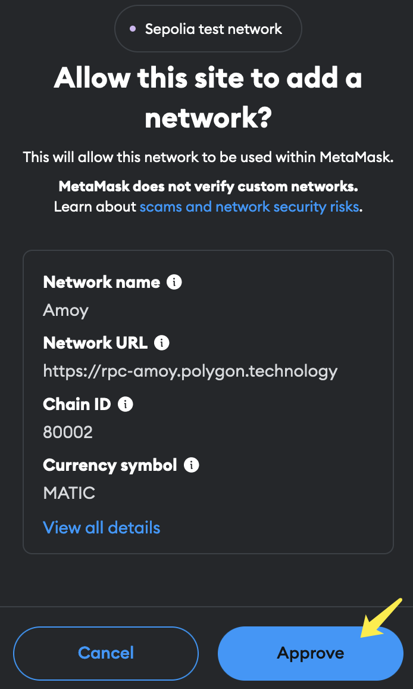
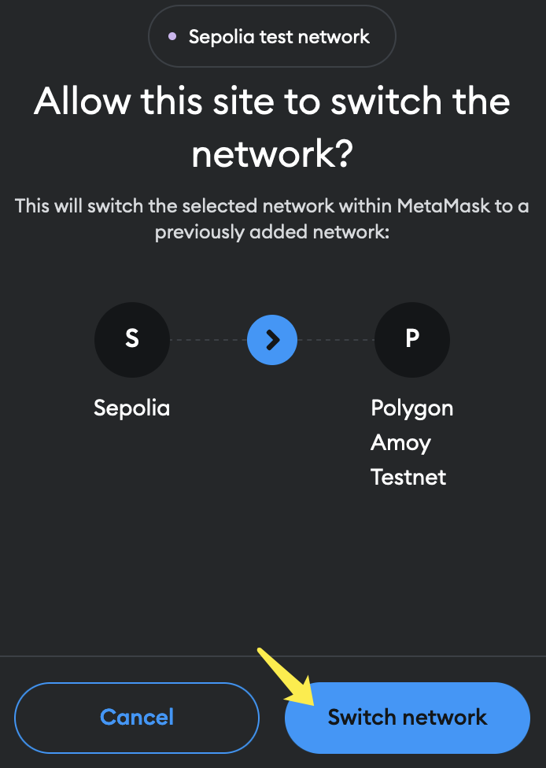

!!! warning "Content disclaimer"

    Please view the third-party content disclaimer [here](https://github.com/0xPolygon/polygon-docs/blob/main/CONTENT_DISCLAIMER.md).

!!! tip "Installing MetaMask"

    Please make sure you have already installed **[Metamask](https://metamask.io/)**!

To track your assets and send transactions on any of the Polygon networks using MetaMask, you'll need to add the respective network configurations to the wallet.

In this doc, we'll go over and demonstrate a few different ways to do this for Polygon PoS testnet (Amoy) and mainnet. You can use the same methods to add Polygon zkEVM to your MetaMask wallet.

- [Using ChainList](../metamask/add-polygon-network.md#using-chainlist)
- [Using Polygonscan](../metamask/add-polygon-network.md#using-polygonscan)
- [Adding a network manually](../metamask/add-polygon-network.md#add-a-network-manually)
- [Importing other tokens](../metamask/add-polygon-network.md#importing-other-tokens)

## Using ChainList

1. Depending on the network profile that you want to add to your MetaMask wallet, use one of the following links to navigate to the respective ChainList page.

    - [Polygon PoS testnet (Amoy)](https://chainlist.org/chain/80002)
    - [Polygon PoS mainnet](https://chainlist.org/chain/137)
    - [Polygon zkEVM testnet (Cardona)](https://chainlist.org/chain/2442)
    - [Polygon zkEVM mainnet](https://chainlist.org/chain/1101)

2. Select the "Add to Metamask" option on the page. This will bring up your MetaMask wallet.

    {width=50%}

3. Select the "Approve" option. This lets ChainList add the network configuration such as the network RPC URL, the chain ID, etc., to your MetaMask wallet.

    {width=50%}

4. Finally, select "Switch network" to switch to Amoy testnet in MetaMask.

    {width=50%}

5. You should now be able to see your MATIC balance on Amoy. You'll also be able to switch between Amoy and other networks directly from the drop-down menu in the top-left corner.

    {width=50%}

## Using Polygonscan

1. Navigate to the [Polygonscan website](https://polygonscan.com/).
2. Select the network you want to add to your MetaMask wallet from drop-down list in the top-right corner of the home page.

    {width=50%}

3. The explorer window should refresh and load the explorer home page for the network you selected.
4. Next, scroll down to the bottom of the page, and click on the button in the bottom-left corner prompting you to add the network your MetaMask wallet. For instance, in the case of Amoy testnet, the button says "Add Polygon Amoy Network".

    {width=50%}

5. Select "Approve" from the MetaMask window. This allows the explorer to add the network configuration to your wallet.

    {width=50%}

6. Finally, click on "Switch network" to switch to your selected network.

    {width=50%}

7.  You should now be able to see your MATIC balance on Amoy. You'll also be able to switch between the current network and other networks directly from the drop-down menu in the top-left corner.

    {width=50%}

## Add a network manually

MetaMask gives you the option to add a network profile manually. You'll need to input the valid network RPC URL, chain ID, and other information for the network you want to add to the wallet. The following table contains the mainnet and testnet network configurations for Polygon PoS and zkEVM.

|         Network         |                 RPC URL                  | Chain ID | Native token |             Explorer URL              |
| :---------------------: | :--------------------------------------: | :------: | :----------: | :-----------------------------------: |
|       PoS mainnet       |    https://polygon-mainnet.infura.io     |   137    |    MATIC     |       https://polygonscan.com/        |
|   PoS Amoy (testnet)    |   https://rpc-amoy.polygon.technology    |  80002   |    MATIC     |     https://amoy.polygonscan.com      |
|      zkEVM mainnet      |          https://zkevm-rpc.com           |   1101   |     ETH      |     https://zkevm.polygonscan.com     |
| zkEVM Cardona (testnet) | https://etherscan.cardona.zkevm-rpc.com/ |   2442   |     ETH      | https://cardona-zkevm.polygonscan.com |

1. Start by selecting the drop-down menu from the top-left corner in MetaMask.

    {width=50%}

2. Select "Add network" option at the bottom of the drop-down list.

    {width=50%}

3. This will bring up the MetaMask settings page in your browser. Select the "Add a network manually" option at the bottom of the page.

    

4. This will take you to a form with multiple fields where you'll need to enter the network configuration (as highlighted in [the table above](#add-the-polygon-network-manually)) for the network you're looking to add in your MetaMask wallet. The following image shows the entries for PoS Amoy testnet. Once you've filled in network config, select "Save".

    {width=50%}

5. This add the network profile to your MetaMask wallet. Select the prompt to switch to your newly added network. You should now be able to between your added network and other networks from the drop-down list on the wallet main page.

    {width=50%}

## Importing other tokens

Looking for a token that didn't show up in the list once you switched networks? Check out MetaMask's guide on [importing tokens to the token list](https://support.metamask.io/managing-my-tokens/custom-tokens/how-to-display-tokens-in-metamask/).