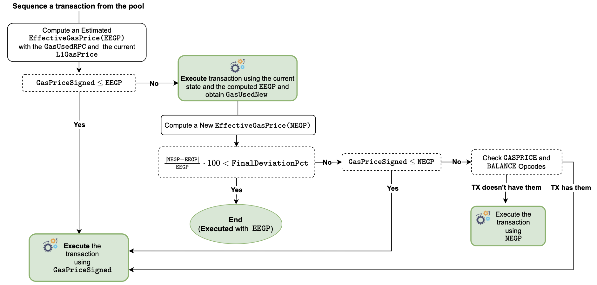

In this phase of the end-to-end transaction flow, transactions go through different stages, depending on the user's $\texttt{GasPriceSigned}$:

1. Sequencing transactions from the pool.
2. Estimating the effective gas price (EEGP) using the current $\texttt{L1GasPrice}$ and RPC's estimated $\texttt{GasUsedRPC}$.
    
    $$
    \texttt{EffectiveGasPrice} = \texttt{BreakEvenGasPrice} \cdot \big(1 + \texttt{PriorityRatio}\big)
    $$

    where the priority ratio is given by:

    $$
    \texttt{PriorityRatio} = \frac{\texttt{SignedGasPrice}}{\texttt{suggestedGasPrice}} - 1
    $$

    Depending on whether $\texttt{GasPriceSigned} \leq \texttt{EEGP}$ or not, transactions get executed with either the $\texttt{GasPriceSigned}$ or the $\texttt{EEGP}$.

3. Amongst the transactions that are computed with the $\texttt{EEGP}$, further gas savings can be achieved by:
    
    - Computing the new effective gas price (NEGP), using the current state and the EEGP.
    - Calculating the gas consumption deviation percentage and comparing it to a fixed deviation parameter. i.e., $\texttt{FinalDeviationParameter} = 10$.
    - There's no further execution if the gas consumption deviation percentage is less than the fixed parameter, $\texttt{FinalDeviationParameter} = 10$.
    - Otherwise, check if $\texttt{GasPriceSigned} \leq \texttt{NEGP}$. If true, then execute transactions again using the $\texttt{GasPriceSigned}$. If false, continue to the next stage.

4. Checking the usage of $\texttt{GASPRICE}$ and $\texttt{BALANCE}$ opcodes.
    
    - Transactions with these two opcodes get executed with the $\texttt{GasPriceSigned}$.
    - Otherwise, they are executed with the $\texttt{NEGP}$.

   Since the sequencer is obliged to execute all transactions in the pool, each transaction is executed during a particular stage of the flow described above.

   The entire sequencer flow is summarized in the figure below.

   

### Example (Sequencer Flow)

Let's continue the numerical example we have been using throughout this document.

As seen in previous examples, the figure below displays L1 gas prices above the timeline, while the associated suggested L2 gas prices are shown below the timeline.

At the time of sequencing the transaction, the suggested gas price is given by,

$$
 \texttt{GasPriceSuggested} = 0.15 \cdot \texttt{L1GasPrice} 
$$

1. Suppose the user signed a gas price of $3.3\ \texttt{GWei/Gas}$.
    
    Recall how we previously obtained the $\texttt{BreakEvenGasPriceRPC}$ of $2.52\ \texttt{GWei/Gas}$.
    
    According to the above figure, the network recommends a gas price of $3$, which corresponds to an L1 gas price of $20$.

    This results in the following priority factor:

    $$
    \begin{aligned}
    \texttt{PriorityRatio} &= \frac{\texttt{SignedGasPrice}}{\texttt{SuggestedGasPrice}} - 1 \\
    \text{ } &= \frac{3.3}{3} - 1 = 0.1
    \end{aligned}
    $$
    
    and an estimated effective gas price:

    $$
    \begin{aligned}
    \texttt{EEGP} &= \texttt{BreakEvenGasPrice} \cdot \big(1 + \texttt{PriorityRatio}\big) \\
    \text{ } &= 2.52 \cdot \big( 1 + 0.1 \big)  = 2.722\ \texttt{GWei/Gas}
    \end{aligned}
    $$

    This amounts to a $10\%$ increment to the gas price for transaction prioritization.

2. Since the signed gas price is bigger than the estimated effective gas price,
    
    $$
    \texttt{SignedGasPrice} = 3.3 > 2.772 = \texttt{EEGP}
    $$

    the transaction can be executed with the $\texttt{SignedGasPrice}$.

3. The sequencer can use the current and correct state, together with the computed $\texttt{EEGP}$, in order to obtain a more accurate measure of the gas used, call it $\texttt{GasUsedNew}$.

    Suppose that, in this case, we obtain

    $$
    \texttt{GasUsedNew} = 95,000\ \texttt{Gas}
    $$

    which is bigger than the RPC-estimated gas of $60,000$.

4. With the new $\texttt{GasUsedNew}$, an adjusted effective gas price ($\texttt{NEGP}$) can be computed in the following steps.
    
    Firstly, the total transaction cost:

    $$
    \texttt{TxCostNew} = (200 · 16 + 100 · 4) · 20 + 95,000 · 20 · 0.04 = 148,000 \ \texttt{GWei}
    $$

    It is assumed that the transaction has 200 non-zero bytes and 100 zero bytes.

    Secondly, the new breakeven gas price: 

    $$
    \texttt{BreakEvenGasPriceNew} = \frac{148, 000}{95, 000} · 1.2 = 1.869\ \texttt{GWei/Gas}
    $$

    where a $20\%$ breakeven factor is applied.

    Thirdly, the new effective gas price:

    $$
    \begin{aligned}
    \texttt{NEGP} &= \texttt{BreakEvenGasPriceNew} \cdot \big(1 + \texttt{PriorityRatio}\big) \\
    \text{ } &= 1.869 · \big( 1 + \big( \frac{\texttt{SignedGasPrice}}{\texttt{SuggestedGasPrice}} - 1 \big) \big) \\ 
    \text{ } &= 1.869 · \big( 1 + \big( \frac{3.3}{3} - 1 \big) \big) \\
    \text{ } &= 1.869 · 1.1 = 2.056\ \texttt{GWei/Gas}
    \end{aligned}
    $$

    Observe that the transaction cost is way higher than the RPC-estimated one of $126,000$ even when the L1 gas price has decreased from 21 to 20 due to a huge increase in gas.

5. Observe that there is a significant deviation between both effective gas prices:
    
    $$
    \frac{|\texttt{NEGP} − \texttt{EEGP}|}{\texttt{EEGP}}  \cdot 100 = 25.82 > 10
    $$

    Executing the transaction with the signed gas price, while the deviation is this big, amounts to penalizing the user unfairly.

    Thus, since the new EGP is smaller than the signed gas price:

    $$
    \texttt{SignedGasPrice}\ = 3.3 > 2.52 =\ \texttt{EEGP} ≫ 2.056 =\ \texttt{NEGP}
    $$

    instead of charging the signed gas price, a further attempt to adjust the gas price is made by charging the $\texttt{NEGP} = 2.056$ to the user.

6. In the case where the transaction has none of the two opcodes, $\texttt{GASPRICE}$ and $\texttt{BALANCE}$, in the source address opcodes, the transaction gets executed with the NEGP:
    
    $$
    \texttt{GasPriceFinal} = \texttt{NEGP} = 2.056\ \texttt{GWei/Gas}
    $$

    Observe that $\texttt{GasUsedFinal}$ should be the same as $\texttt{GasUsedNew} = 95,000$.

    Finally, the $\texttt{EffectivePercentage}$ and $\texttt{EffectivePercentageByte}$ are  computed as follows:

    $$
    \texttt{EffectivePercentage} = \frac{\texttt{GasPriceFinal}}{\texttt{SignedGasPrice}} = \frac{2.056}{3.3} = 0.623.
    $$

    $$
    \texttt{EffectivePercentageByte} = \lfloor \texttt{EffectivePercentage} · 256 \rfloor − 1 = 158
    $$

    Observe that the user has been charged $62.3\%$ of the gas price they signed at the time of sending the transaction.
