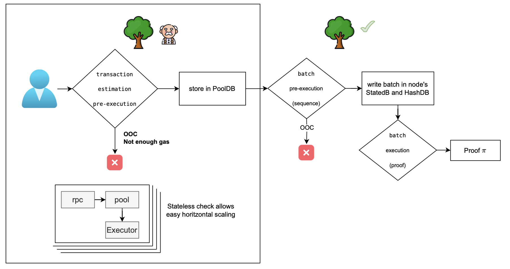

This document presents an outline of Polygon zkEVM's strategy for executing transactions with the most accurate effective gas price.

- **Poll for L1 gas price regularly**
    
    Since the L1 gas price fluctuates and the L2 gas price relies on it, it is necessary to query and fetch the L1 gas price frequently and thus have the most recent value at any given point in time.

    The Polygon zkEVM polls for the L1 gas price in regular intervals of 5 seconds.

    The polled gas prices are used to set the expected 'signed gas price', called $\texttt{MinL2GasPrice}$.

- **Provide suggested gas prices**
    
    The polled L1 gas price values are sent to users upon request individually.

    A grace time interval of 5 minutes, called $\texttt{MinAllowedPriceInterval}$, is given to the user.

    It is recommended that the user sign their transactions with a gas price *greater than the lowest* of the gas prices fetched within the 5-minute interval. Otherwise, the transaction is rejected at the RPC pre-execution stage.

- **Pre-execute transactions at the RPC level**
    
    Pre-execution of transactions involves:
        
    (a) Estimation of each transaction's possible consumption of L2 resources. That is, determining an approximate gas cost.

    (b) Checking user’s signed gas price against the expected $\texttt{MinL2GasPrice}$. Store the transaction in the pool if $\texttt{SignedGasPrice} < \texttt{MinL2GasPrice}$​. Otherwise discard it.

    (c) The pool here refers to a collection of transactions waiting to be selected for execution by the sequencer.

- **Put in place a criterion for determining which transactions to store in the pool**
    
    Only the transactions that satisfy the criterion are stored on the pool.

    The user's signed gas price is checked against either the breakeven factor, or the gas price suggested to the user.

- **Establish a criterion for when to execute transactions with user's signed gas price**
    
    Some users' signed gas prices may be significantly higher than the effective gas price. In such cases, the sequencer can execute transactions with a much lower gas price to help save gas fees.

    Hence, there's a need for a criterion that determines whether a transaction gets executed with the user's signed gas price, or the effective gas price as per the RPC estimation.

- **Set a criterion for when to execute transactions with RPC-estimated EGP**
    
    The effective gas price computed with the RPC-estimated gas price could be a lot higher than the actual gas price computed with the current state. In this case, the system can further optimize gas usage and help the user save on gas fees.

    The strategy here is to have a criterion that determines whether a transaction should get executed with the RPC-estimated effective gas price (EEGP) or the new effective gas price (NEGP), which results from the actual gas price.

- **Checking whether transactions include special opcodes**
    
    The presence of opcodes such as $\texttt{GASPRICE}$ and $\texttt{BALANCE}$ in transactions can result in higher gas usage.

    zkEVM executes such transactions with the user's signed gas price.

- **Enhancing prioritization of transactions**
    
    Since transactions are sequenced in decreasing order of the specified gas price, with higher preference given to large values, users need to provision sufficient gas price to allow for prioritization of transactions according to their needs.

    
