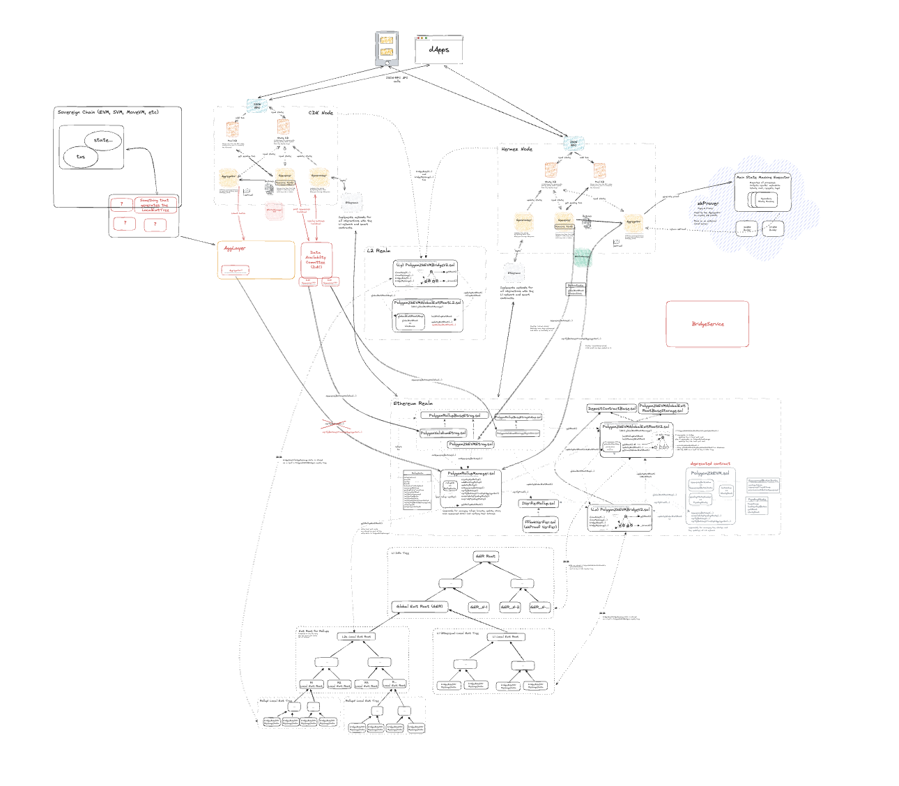

<!-- https://excalidraw.com/#json=JKZp9QEihifF_B7Z41Dfv,FVNhqQKi9PA1jM0kzUoCsQ" -->

## Intro

This section of the docs looks more closely at the full topology of the Polygon zero-knowledge system architecture. 

Built for CDK stacks and using zkEVM technology, these documents explain the contents, layout, and interactions between component systems and functions, drilling down into detailed descriptions of the components that make up the wider system with reference to the relevant code bases.

The diagram below is a full and detailed topological overview of the entire Polygon zero-knowledge system architecture.

## Architectural topology

## Components 

- Smart contracts: L1 and L2 Solidity smart contracts used for interacting with the whole stack. See the discussion on [zkEVM smart contracts](../../architecture/protocol/zkevm-bridge/smart-contracts.md) for more information.
- Exit root trees: Append-only sparse Merkle trees which record the current and historical state of the system. See the discussion on [zkEVM exit trees](../../architecture/protocol/zkevm-bridge/exit-tree.md) for more information.
- Aggregator: Used for aggregating transactions into batches for proving. See the discussion on [aggregators](../../architecture/index.md#aggregator) for more information.
- Sequencer: Does the complex job of carefully sequencing transactions as they come in before sending them to the aggregator for batching. See the discussion on [sequencers](../../architecture/index.md#sequencer) for more information.
- Synchronizer: This component ensures a synchronized state between the node's systems and the L1 outside world via the Etherman component and the state database. 
- Etherman component: The Etherman helps the synchronizer maintain a synchronized state with L1 by communicating with the L1 Ethereum chain via smart contract methods.
- JSON RPC client: Allows computational read/write access to the system via published methods which, when called, interact with the pool and state databases.
- Pool database: The pool database records transaction requests coming in from the JSON RPC client and sends them to the sequencer.
- State database: The state database responds to read requests from the JSON RPC client.
- Bridge service component: Main facility for transferring tokens from L1 to L2 and back again.

## What to expect

When complete, this section will include information on: 

- The structure of a CDK node and how it interacts with L2 and L1 smart contracts.
- The structure of a zkEVM node and how it interacts with L2 and L1 smart contracts.
- The key components included in the nodes, how they function, and their interactions with other components, external developers, and the L1/L2 environment.
- Key similarities and differences between a CDK and zkEVM node set up.
- CDK validium components, including the DAC and DAC sequencer.
- Detailed description of the Polygon smart contract sets for L1 and L2.
- The zkProver and how it interacts with a zkEVM node aggregator.

### Currently out of scope

- The bridge service.
- AggLayer.
