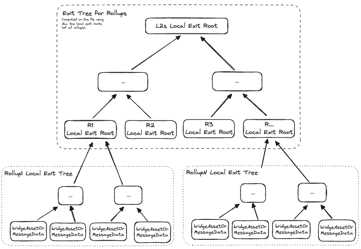

An exit tree is an append-only sparse Merkle tree (SMT), or binary tree, whose leaf nodes store bridging data. The exit trees have a depth of 32.

Whenever a token or message is bridged, the bridge contract appends an exit leaf to the tree related to the specific network.

## Local exit trees

The bridge uses a special Merkle tree called a local exit tree for each network that participates in bridging and claiming. 

Data from `bridgeAsset()` and `bridgeMessage()` calls on the bridge is stored in leaf nodes on the local exit trees. 

## Exit tree for rollups

The roots of the local exit trees feed into an exit tree for all participating L2 rollups.

The L2 local exit root is accessible on the rollup manager by calling the `getRollupExitRoot()` method.

## L1 local exit tree

Data from `bridgeAsset()` and `bridgeMessage()` calls on the bridge at the L1 Ethereum level is stored in leaf nodes on the L1 local exit tree.

## L1 info tree

All the subtrees feed into the L1 info tree which contains the global exit root (GER). 

The GER is the fingerprint of all the information stored in all trees and thus represents the true state of the system.

!!! tip
    - Read more about exit trees in our [exit tree documentation](../../protocol/zkevm-bridge/exit-tree.md).