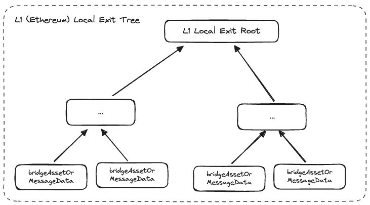
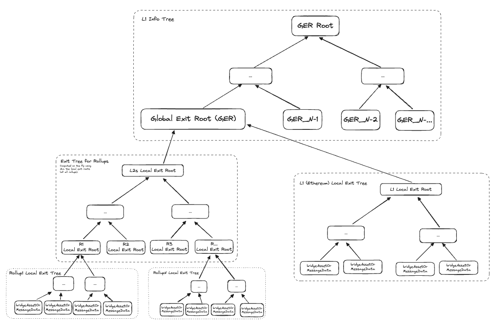

An exit tree is a binary append-only sparse Merkle tree (SMT) whose leaf nodes store bridging data. The exit trees have a depth of 32.

Whenever a token or message is bridged, the bridge contract appends an exit leaf to the exit tree related to the specific network. 

The Merkle root of an exit tree is known as the exit tree root, and it is the fingerprint of all the information recorded in the exit tree's leaf nodes. 

The global exit tree root of the L1 info tree is, therefore, the source of truth for the whole network. 

## Local exit trees

The L2 bridge has a special Merkle tree called a local exit tree for each network that participates in bridging and claiming. 

<center>

</center>

Data from `bridgeAsset()` and `bridgeMessage()` calls on the bridge is stored in leaf nodes on the local exit trees. 

## Exit tree for rollups

The roots of the local exit trees feed into a single exit tree that manages state from all participating L2 rollups.

<center>

</center>

The L2 local exit root is accessible on the rollup manager by calling the `getRollupExitRoot()` method.

## L1 local exit tree

Data from `bridgeAsset()` and `bridgeMessage()` calls on the bridge at the L1 Ethereum level is stored in leaf nodes on the L1 local exit tree.

<center>

</center>

## L1 info tree

All subtrees feed into the L1 info tree, which contains the global exit root (GER). 

The GER is the fingerprint of the information stored in all trees, and thus represents the true state of the system.

<center>

</center>

## Exit leaves

Two constants define leaf types in the bridge contract.

```solidity
// Leaf type asset
uint8 private constant _LEAF_TYPE_ASSET = 0;

// Leaf type message
uint8 private constant _LEAF_TYPE_MESSAGE = 1;
```

Data in a leaf is a Keccak256 hash of the metadata (ABI encoded metadata if any) with the following parameters:

```solidity
_addLeaf(
    getLeafValue(
        _LEAF_TYPE_ASSET, // or _LEAF_TYPE_MESSAGE_
        originNetwork,
        originTokenAddress,
        destinationNetwork,
        destinationAddress,
        leafAmount,
        keccak256(metadata)
    )
);
```

!!! info "Leaf parameters"
    - int32 originNetwork: Origin network ID, where the original asset belongs.
    - address originTokenAddress: If `leafType = 0`, Origin network token address (`0x0000...0000`) is reserved for ether. If `leafType = 1`, `msg.sender` of the message.
    - uint32 destinationNetwork: Bridging destination network ID.
    - address destinationAddress: Address that receives the bridged asset in the destination network.
    - uint256 leafAmount: Amount of tokens/ether to bridge.
    - bytes32 keccak256(metadata): Hash of the metadata. This metadata contains information about asset transferred or the message payload.

## Asset transfer scenarios

In this subsection, we present two scenarios to illustrate the role of exit trees and the global exit tree in the asset transfer process.

### Transfer from L1 to rollup L2

Consider a scenario where a user wants to transfer assets from the L1 Mainnet to the L2 Rollup.

Once the user commits to a transfer, a new exit leaf with the information of the assets being bridged is appended to the L1 exit tree. The transfer data typically looks like this:

```
Origin network: 0 (L1)
Origin address: 0x56566... 
Dest Network: 1 (L2)
Dest Address: 0x12345...
Amount: 145
Metadata: 0x0...
```

With the newly added exit leaf, the L1 exit tree now has a new root. Updating the global exit tree with this new L1 exit tree root means changing the root of the global exit tree.

To claim the bridged assets on the destination L2 network, the global exit root is verified using a Merkle proof. This proof allows one to confirm whether an exit leaf, containing information about assets being bridged to L2, is represented in the global exit tree by the corresponding L1 exit tree root.


### Transfer from rollup L2 to L1

Transfers can also occur from an L2 Rollup to the L1 mainnet. In this scenario, the same procedure outlined in the previous example is followed, but in the reverse direction.

That is, once a user commits to a transfer, an exit leaf is added to the L2 exit tree with corresponding transfer information. The transfer data in this case looks as follows:

```
Origin network: 3 (L2)
Origin address: 0x34655... 
Dest Network: 0 (L1)
Dest Address: 0x27564...
Amount: 92
Metadata: 0x116...
```

The newly added L2 exit leaf means the L2 exit tree has a new root. The new L2 exit tree Root is then appended to the global exit tree, and thus the root of the global exit tree is updated.
