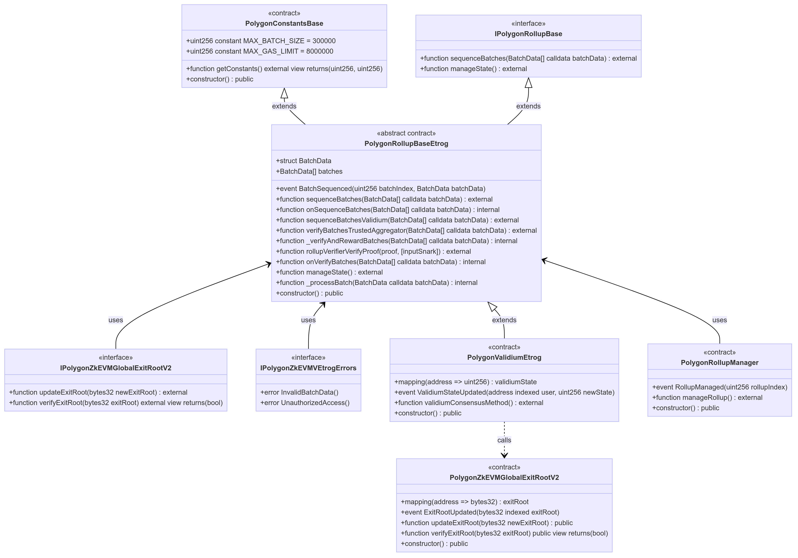

<!-- https://excalidraw.com/#json=JKZp9QEihifF_B7Z41Dfv,FVNhqQKi9PA1jM0kzUoCsQ" -->

## Polygon smart contract architecture

The diagram below details the Polygon Solidity smart contract architecture. 

It shows the key contracts that manage rollup and validium stack behavior, and describes the relationships between them. 

The stacks direct transaction data into the L2 and L1 realms via smart contract calls. The system stores state in binary tree structures containing verifiable local and global exit roots.

In the Ethereum realm, the set of consensus contracts and the methods they expose fuel the sequencing and verification mechanisms triggered by stack components such as the sequencer and aggregator. We also note the main rollup management contract which is responsible for creating, updating, and verifying rollups.

In the L2 realm, the L2 bridge contract manages bridging and claiming activity between L1 and L2, and the exit root mechanisms that govern state at this layer. 

Back in L1, the system state as a whole is stored on binary trees with data and/or exit roots written into their leaves. Updates at the leaf-level trigger exit root updates which are then available to the consensus contracts via the L1 bridge contract.

### Rollup contracts

The main contracts for the zkEVM rollup stack are [PolygonRollupManager.sol](https://github.com/0xPolygonHermez/zkevm-contracts/blob/main/contracts/v2/PolygonRollupManager.sol) which is responsible for managing rollup and validium transaction batches. 

The L1 bridge contract [PolygonZkEVMBridgeV2.sol](https://github.com/0xPolygonHermez/zkevm-contracts/blob/main/contracts/v2/PolygonZkEVMBridgeV2.sol) is responsible for bridging and claiming activity across L1 and L2 chains. 

The [PolygonZkEVMGlobalExitRootV2.sol](https://github.com/0xPolygonHermez/zkevm-contracts/blob/main/contracts/v2/PolygonZkEVMGlobalExitRootV2.sol) contract manages the exit roots across multiple networks at the Ethereum L1 level.

### Valdium contracts 

The CDK validium stacks use the [cdk-validium-contracts](https://github.com/0xPolygon/cdk-validium-contracts/tree/main) which has slightly adjusted behavior to take account of validium components, such as in the [PolygonZkEVMGlobalExitRootL2.sol](https://github.com/0xPolygon/cdk-validium-contracts/blob/main/contracts/PolygonZkEVMGlobalExitRootL2.sol) contract for example. 

The CDK repo is a fork of the zkEVM main contracts repo and all contracts, therefore, extend from common interfaces.

!!! important
    - A CDK validium stack starts life as a rollup stack. 
    - It may be referred to as such interchangeably when discussing aspects shared by the two options.
