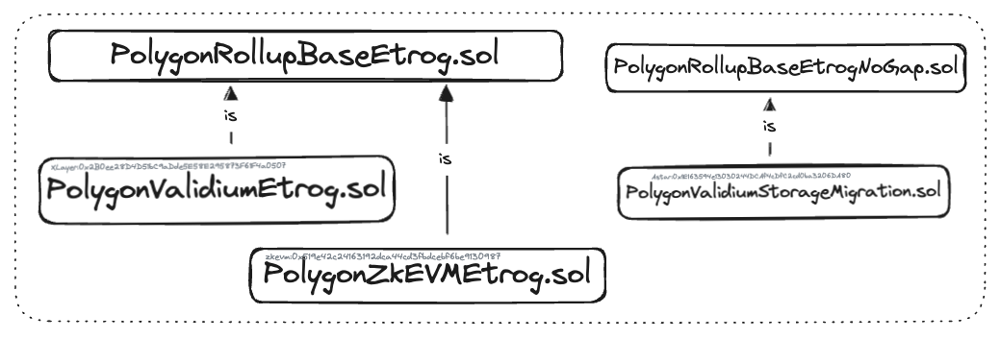
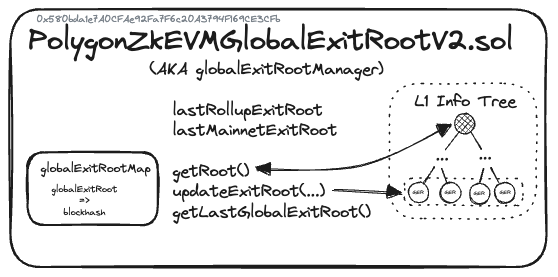

The skeleton-class diagram below reveals the smart contract architecture of rollup and CDK stacks.

## Polygon smart contract architecture

Chain stacks at the node level direct transaction data to the L2 and L1 networks via smart contract calls. The system stores state in binary tree structures containing verifiable local and global exit roots.

The diagram below details the Polygon Solidity smart contract architecture minus the bridging contracts. 

And here is the class diagram for the unified bridge and exit roots activity.

There are four key contract types built into the system design: 

- The [consensus contract set](#consensus-contracts). 
- The [rollup manager](#rollup-manager). 
- The [bridge contract](#bridge). 
- [Exit root management contracts](#global-exit-roots).

## Consensus contracts

In the Ethereum realm, the set of consensus contracts and the functions they expose fuel the sequencing and verification mechanisms triggered by stack components, such as the sequencer and aggregator, at the node level. 

These contracts define the type of chain, i.e. validium or non-validium, and there is usually a single contract per CDK chain that supplies custom functionality.

## Rollup manager

The [PolygonRollupManager.sol](https://github.com/0xPolygonHermez/zkevm-contracts/blob/main/contracts/v2/PolygonRollupManager.sol) contract is responsible for creating, updating, and verifying CDK rollup and validium chains.

{ width=80% }

## Bridge 

The unified bridge contract [PolygonZkEVMBridgeV2.sol](https://github.com/0xPolygonHermez/zkevm-contracts/blob/main/contracts/v2/PolygonZkEVMBridgeV2.sol) is responsible for bridging and claiming activity across L1 and L2 chains. 

{ width=80% }

In the L1 network, the bridge also manages the complex exit root mechanism governing system state. In the L2 network, there is a lighter exit root mechanism that governs state at this layer. 

## Global exit roots

System state as a whole is stored on binary trees with data and/or exit roots written into their leaves. 

Local updates at the leaf-level trigger exit root updates at the top of the trees which are then available to the global exit root trees and the consensus contracts via the L1 bridge contract.

The [PolygonZkEVMGlobalExitRootV2.sol](https://github.com/0xPolygonHermez/zkevm-contracts/blob/main/contracts/v2/PolygonZkEVMGlobalExitRootV2.sol) contract manages the exit roots across multiple networks at the Ethereum L1 level.

{ width=60% }

The L2 exit root management contract, [PolygonZkEVMGlobalExitRootL2.sol](https://github.com/0xPolygon/cdk-validium-contracts/blob/main/contracts/PolygonZkEVMGlobalExitRootL2.sol), has a lighter-weight exit root mechanism.

{ width=60% }

## Validium stacks

CDK validium stacks use the [cdk-validium-contracts](https://github.com/0xPolygon/cdk-validium-contracts/tree/main) which has slightly adjusted behavior to take account of validium components and CDK custom requirements. 

The CDK repo is a fork of the zkEVM main contracts repo and all contracts, therefore, extend from common interfaces.

!!! important
    - A CDK validium stack starts life as a rollup stack. 
    - It may interchangeably be referred to as such when discussing aspects shared by the two options.
