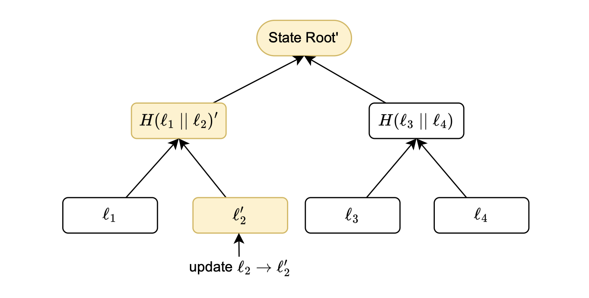
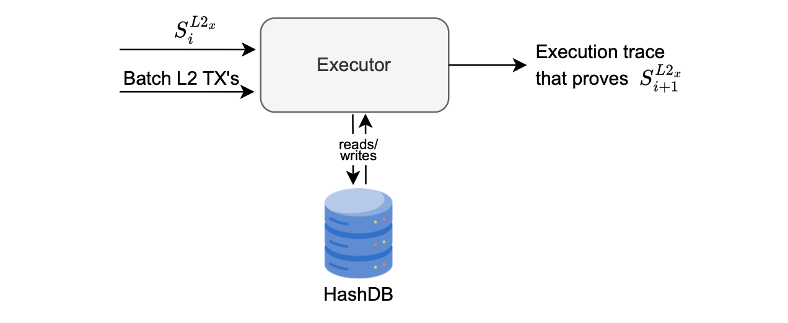

This document explains how the zkEVM proving system manages changes in the L2 state tree.

The main components of the zkEVM proving system are, the ROM, the prover _hashDB_, and the storage state machine's executor.

In the zkEVM context, as in Ethereum, it is crucial to ensure the accuracy of state changes resulting from the execution of transactions.

## zkEVM ROM

The zkEVM ROM, written in zero-knowledge Assembly (zkASM), is a program designed to prove computations related to correct L2 state transitions resulting from L2 transactions in a given batch.

Often, multiple zkASM instructions are used to implement a single zkEVM opcode.

The L2 state is captured in the form of a Merkle tree, and its Merkle root, referred to as the _state root_, uniquely represents the summary of the current state data.

The zkEVM ROM must, therefore, have the capability to correctly execute the _create_, _read_, _update_, and _delete_ (CRUD) operations on the Merkle tree.

## The storage state machine

The zkEVM implements a secondary state machine, known as the _storage state machine_, specifically for generating an _execution trace_. 

The execution trace provides evidence for any creation, reading, updating, or deletion of L2 state data.

Any operation applied to the Merkle tree must be evidenced with proof, attesting that the tree modification was executed correctly.

Such a proof consists of the sibling node and other relevant hash nodes sufficient for verification purposes. This is called a Merkle proof.

An example of a Merkle proof can be found in the [Concepts section](https://docs.polygon.technology/zkEVM/concepts/sparse-merkle-trees/sparse-merkle-tree/?h=merkle+proof#keys-and-navigating-a-merkle-tree).

Verifying a Merkle proof involves using the given information to compute the Merkle root and checking if it matches the actual Merkle root.

After processing the last L2 transaction in a batch, the resulting root becomes the _new state root_.

### Example. (Proving read and update operations)

We provide illustrative examples showcasing two CRUD operations on the L2 state: _read_ and _update_ operations.

The storage state machine is responsible for providing validity proofs of these operations.

Consider the figure above, where the objective is to read the information stored in the fourth leaf ($l_4$). 

Suppose a user carries out a transaction, and let $l_4$ represent the balance of the account that initiates the transaction.

In the process of reading this leaf, it is crucial to verify its _inclusion_ in the current state at the specified position.

This is deterministically computed from some unique properties of the data being stored, such as the account address or the type of data.

In the figure above, the blue boxes represent data that must be supplied to the storage state machine for the generation of the execution trace.

As typically required when verifying a Merkle proof, the data stored in the blue boxes enable the storage state machine to validate that the computed root matches the state root of the Merkle tree.

Consider the figure above, and in this case we examine a scenario where a leaf is updated.

A leaf update means changing the leaf's value, which consequently modifies the state root.

Consequently, the yellow boxes in the figure represent all affected nodes, as they incorporate information from the updated leaf $l_2$. 

The storage state machine is used once again to generate an execution trace, ensuring the accuracy of all tree modifications.

Following the same procedure as in the _read_ case, the consistency of the state root is verified to confirm that the changes have been accurately executed.

## The storage SM executor and hashDB

All essential hashes required for computing execution traces are stored in the _hashDB_. 

During the execution of the L2 state’s related zkEVM opcodes, such as SSTORE or SLOAD, the storage state machine’s executor consistently retrieves values from the hashDB and uses them to construct the corresponding execution traces.

The hashDB contains all the hashes, which are all the nodes of the Merkle tree of the L2 state.

The figure below depicts an interaction of the executor with the hashDB, when proving the state transition from $S^{L2_x}_i$ to $S^{L2_x}_{i+1}$. 

The executor takes as inputs, the current state $S^{L2_x}_i$ and a batch of transactions, retrieves Merkle proofs from the hashDB, and produces the execution trace representing all changes to the state tree.

It is important to note that the Merkle tree used in the Polygon zkEVM is a binary sparse Merkle tree (SMT), distinguishing itself from the Merkle tree used in the L1 EVM.
