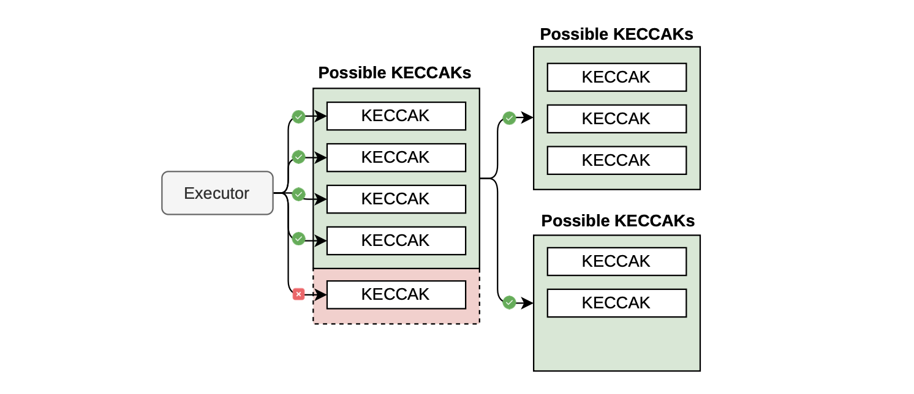
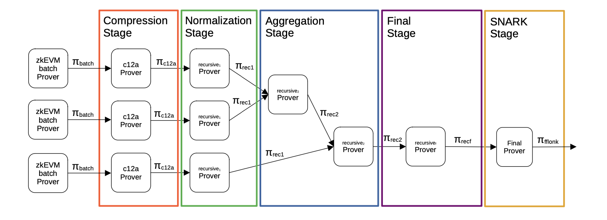
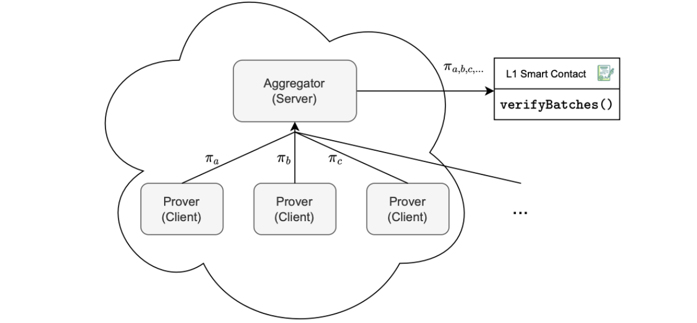
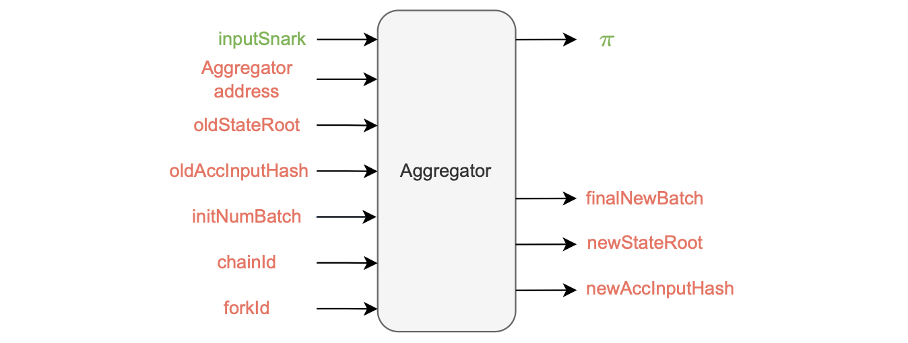

In this document, we delve into a crucial component of the zkEVM called the aggregator. 

The aggregator takes several proofs, each attesting to correct execution of some batch, and combines them into a single proof.

Verifying the combined proof is equivalent to confirming the accuracy of all individual proofs for each batch.

The mechanisms used by the aggregator to generate such an aggregated proof are known as _proof recursion_ and _proof aggregation_. Both mechanisms aim at increasing the system throughput.

This document:

- Provides some insight on how both the _proof recursion_ and _proof aggregation_ mechanisms work.

- Discusses topics such as the "prove anything" paradigm, which is a mechanism that allows proofs of any input to be generated regardless of whether it is erroneous or not.
    
    And, of course, since an invalid input should not cause a state change, the corresponding proof attests to the absence of a state change rather than its presence.

- Explores the _zkCounters_ concept, which refers to a mechanism used in the zkEVM to measure batch sizes and ensures that only batches that fit into execution traces are allowed.

    In the event of a batch size exceeding set limits, the system should throw an _out of counters_ (OOC) error.

- Concludes with a discussion on how to eliminate zkCounters in the future, achievable by implementing a method known as _Variable Degree Composite Proofs_ (VADCOPs).

## Prove anything paradigm

To address the potential threat of malicious sequencers, we adopt the “prove anything" paradigm. 

With this approach, the prover possesses the capability to generate a proof of execution for any input data.

But this is on the condition that each batch must maintain a bounded amount of data.

The smart contract ensures compliance with this requirement throughout the sequencing process.

Batch execution is carried out for any input data, resulting in the generation of a proof that confirms a state change for valid input data, or no state change for invalid input data, as depicted in the figure below.

This strategy guarantees robust validation of execution outcomes, and provides a reliable mechanism to handle potential, malicious behavior.

### Invalid transactions

Let us describe some errors in transactions that cause the state to remain unchanged, as shown in the figure below.

#### Reverted transaction

A transaction may revert during execution due to many reasons, such as:

- Running out of gas.

- Having a stack that is too large.

- Encountering a revert call in the code.

This is a common scenario in EVM processing.

#### Invalid intrinsic transaction

An invalid intrinsic transaction is a transaction that cannot be processed, and thus has no impact on the current state.

Keep in mind that this transaction could be part of a virtual batch. Examples of errors in this scenario are: incorrect nonce, insufficient balance, etc.

The zkEVM's trusted sequencer is unlikely to input an incorrect nonce. However, any member of the community can submit a batch, which may result in an error.

### Invalid batches

Some of the errors that occur at the batch level can cause the state to remain unchanged.

As depicted in the figure below, such errors might occur due to invalid data, or exhaustion of prover resources.

- Invalid Data: Failure to decode RLP-encoded transactions, that is having garbage input.
- Prover resource exhaustion: The zkEVM prover manages resources in terms of row counters in the Stack, also known as _zkCounters_. Processing a batch may fail due running out of zkCounters (OOC).

The above figure shows that when batch processing fails, the state remains unchanged, $S^{L2_x}_{i+1} = S^{L2_x}_{i}$, and a proof of _no state change_ is produced. 

Although this occurrence is infrequent, it is possible.

The *prove anything* approach allows the system to implement an anti-censorship measure called _forced batches_.

That is, in the case where the trusted sequencer does not process a user's transactions, the user can take the role of a sequencer by taking their L2 transactions into the virtual state.

The main use case is to allow a user to send bridge transactions to withdraw assets from L2 without the risk of censorship, which would otherwise make fund withdrawals impossible.

Since every user who sends L2 batch data is, by default, 'untrusted,' the system must ensure that anything sent by any user can be verified.

The _forced batches_ mechanism is elaborated on in the [Malfunction resistance subsection](../../../zkEVM/architecture/protocol/malfunction-resistance/sequencer-resistance.md).

## zkCounters

Counters are used during the execution of a batch to monitor the row count in each state machine, including the main state machine.

The management of these counters is incorporated within the computation process. This way, if a computation exhausts its assigned resources while generating the proof, the system can verify and prove that the batch does not cause a state change.

As mentioned earlier, the issue of running out of assigned resources is referred to as an _out of counters_ (OOC) error.

This error is specific to the Polygon zkEVM state machine design, where the execution trace has a fixed number of rows.

The figure below depicts a simplified scenario of the OOC error for a [Keccak state machine](../zkprover/hashing-state-machines/keccakf-sm.md), where its arithmetization permits only up to four Keccak operations before exhausting the available rows.

So, an OOC error occurs if a transaction invokes five or more Keccak operations.

### VADCOPs

Although the current version of the proving system has this limitation in the backend (forcing execution traces of all state machines to have the same amount of rows), it is expected to be resolved with the implementation of a proving technique called _variable degree composite proofs_ (VADCOPs).

VADCOPs are designed to partition large execution traces with many rows into smaller execution traces with fewer rows.

The main advantage with VADCOPs is the elimination of zkCounters.

See the figure below for a simplified illustration of the basic idea of what VADCOPs can achieve.

In this scenario, it becomes feasible to execute five Keccak operations despite the limit of executing only four operations at a time.

At a high level, the solution involves splitting the proof into two parts, each containing fewer rows, and then aggregating them to demonstrate the execution of five Keccak operations.

The ongoing development of VADCOPs includes rewriting of both the cryptographic backend and the constraint language called _Polynomial Identities Language_ version 2 (PIL2).

## Discussing the proof

The preceding subsection has briefly outlined what VADCOPs can do. 

The concept of VADCOPs suggests that we can somehow aggregate proofs together.

Even though aggregating proofs requires more effort from the prover, it allows many proofs to be verified simultaneously.

This scenario is of interest to us because it creates a single, unified proof that allows various batches to be verified simultaneously, thereby increasing system throughput.

Two techniques of interest in this area are _proof recursion_ and _proof aggregation_.

### Proof recursion

Recursion, which is also called _compression_, in proof systems means the prover deals with smaller, quicker-to-verify proofs instead of large, time-consuming proofs.

Essentially, the prover generates a proof at the current stage that attests to the fact that the verification of the previous stage was correctly performed.

At the end of the proof recursion, a SNARK proof is generated to attest to the correct verification of each final proof.

Consequently, since the succinctness property of SNARKs dictates that verification time should be relatively smaller than the proving time, the final SNARK proofs are much smaller and faster to verify than the proofs in the initial stages.

The figure below illustrates the core principle of proof recursion.

The "Outer Prover", seen in the figure above, is responsible for proving the correct verification of the proof $\pi_{big}$ and it outputs the proof $\pi_{small}$  which is sent to the "Outer Verifier".

The proof $\pi_{small}$ being a SNARK proof is therefore much smaller compared to $\pi_{big}$ due to the succinctness property of SNARKs.

Notice that the set of public values vary from one recursion stage to the next.

### Proof aggregation

In the zkEVM context, aggregation is a technique that allows the prover to generate a single proof that covers multiple L2 batches.

This reduces the number of proofs to be verified, and thus increases the system throughput.

Proof aggregation means sending a single L1 transaction that aggregates multiple batches, and this improves the batch consolidation rate.

Note that the proving system limits aggregation to consecutive batches only.

Also, we can aggregate single-batch proofs with multiple-batch proofs, as shown in the figure below.

This is achievable because of a technique, used in the cryptographic backend, called _normalization_.

Finally, we remark that the smart contract also sets limits to the number of batches that can be aggregated.

### zkEVM recursion and aggregation

We now provide concrete blocks and steps used to prove correct execution of several batches by the Polygon zkEVM, using recursion and aggregation.

An overview of the overall process is depicted in the figure below.

The first proving system generates such a big proof since it has a lot of high degree polynomials. 

Thereafter, the *Compression Stage* is invoked and applied on in each batch proof, aiming to reduce the number of polynomials used, and hence allowing reduction in the proof size.

Next, the *Normalization Stage* is invoked, allowing each aggregator verifier and the normalization verifier to be exactly the same, permitting successful aggregation via a recursion.

Once the normalization step has been finished, the proofs go through aggregation. 

The procedure is to construct a binary tree of proofs by aggregating every pair of proofs into one. We call this step, the _Aggregation Stage_.

In this step, two batch proofs are put together into one, and this repeated for as long as there there's more than one proofs to aggregate.

Observe that the *Aggregation Stage* is designed to accept:

- Two compressed proofs.

- Two aggregated proofs.

- One compressed proof and an aggregated proof.

The *Final Stage* is the last STARK step of the recursion process, which is in charge of verifying a proof over a finite field associated with the $\text{BN128}$ elliptic curve. 

This field is completely different from the Goldilocks field $\mathbb{F}_p$, where $p = 2^{64} - 2^{32} + 1$, which is used in all earlier stages of the proof recursion and aggregation process.

The _SNARK Stage_ converts the STARK proof, which is the output of the _Final Stage_, to an FFLONK proof.

The final output of the proof recursion and aggregation process is an FFLONK proof, which is a SNARK, and it gets verified via the [ec-pairing](https://www.evm.codes/precompiled#0x08?fork=cancun) precompiled contract.

## Introducing the aggregator

In the Polygon zkEVM architecture, the aggregator is the component responsible for performing proof aggregation.

Its role is to aggregate several proofs into one, and send the aggregated proof to the L1 Smart Contract through the $\texttt{verifyBatches()}$ function.

The aggregator invokes the $\texttt{verifyBatches()}$ function on the smart contract, passing the following parameters:

- The initial batch number, $\texttt{initNumBatch}$.
- The final batch number, $\texttt{finalNewBatch}$.
- The root, $\texttt{newStateRoot}$.
- The aggregated proof, $\mathbf{\pi_{a,b,c,...}}$.

See the figure below, depicting a single, aggregated proof, $\pi_{a,b,c,...}$, as an input to the verifier smart contract.

The previous root is stored in the smart contract, eliminating the need to transmit it.

Recall that the smart contract contains a summary of the batch information in the _accumulated input hash_.

As seen in the figure above, provers link up with the aggregator to send their proofs.

The aggregator operates as a network server, establishing connections with provers that function as network clients.

Thus, it functions as a server, responsible for determining how to horizontally scale provers to achieve an optimal batch consolidation rate. Scaling is essential to prevent a buildup of additional batches awaiting consolidation. 

The aggregator also keeps a record of authorized provers. Both the aggregator and the provers operate in a cloud-based environment, with the provers configured as high-resource instances.

See the figure below, for such a cloud-based environment.

The configuration allows for effective and scalable control over evidence processing, ensuring the system can handle various workloads while maintaining an efficient batch consolidation rate.

### Proof inputs and outputs

The proof generation process requires several inputs to ensure its soundness:

- The aggregator address, serves as a safeguard against malleability in the $\texttt{verifyBatches()}$ function, ensuring that no one can use another aggregator’s proof.
- The previous state root (oldStateRoot), which is already included in the smart contract and does not require explicit sending.
- The previous accumulated input hash ($\texttt{oldAccInputHash}$).
- The initial batch number ($\texttt{initNumBatch}$).
-  The chainID and the forkID ensure that the proof is valid only within the intended chain and version of the zkEVM.

The figure below, depicts the aggregator inputs and outputs.

The aggregator generates the following outputs:

- The updated state root, $\texttt{newStateRoot}$.

- The new accumulated input hash,  $\texttt{newAccInputHash}$.

- The aggregated proof, $\pi$.

- The batch number of the last batch included in the aggregated proof once it has been successfully generated ($\texttt{finalNewBatch}$).

Currently, all the inputs and outputs are public. And this presents an efficiency problem, which we discuss below.

The smart contract structure shown in the figure below, enables upgradeability or alteration of the verifier, as necessary.

Currently we only provide a verifier called `FflonkVerifier.sol`.

In this approach, the verifier must utilize a list of publics. But, a verifier with a single input is more cost-effective.

In Groth16, for instance, there is one _scalar multiplication_ operation per public input, which costs approximately $10,000$ gas units per public.

The key strategy is therefore to:

- Create a single public input, which is the hash of all the previous public keys.

- Transform all other public inputs into private inputs.

The figure below depicts this configuration, where public inputs are in green while private inputs are in red.

Hence, for the outer proof, there is a single public input in the aggregator called $\texttt{inputSnark}$, which is a Keccak hash of all the previous public inputs and outputs.

Therefore, when `ZkEVM.sol` contract interacts with the `VerifierRollups.sol` contract, only a single public parameter is passed, minimizing data transmission costs.

This optimized approach requires two verifications:

- Checking that the hash of all private inputs, arranged in the correct order, corresponds to the given $\texttt{inputSnark}$.

- Verifying that the total input hash, calculated for all processed batches by the aggregator, matches the specified $\texttt{newAccInputHash}$.
