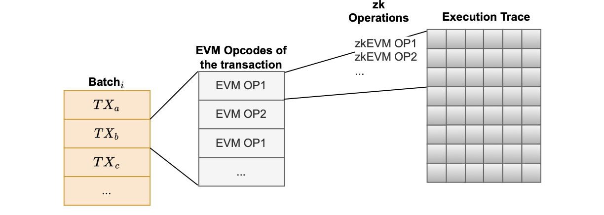

In our current cryptographic backend, the dimensions of the execution trace are predetermined.

However, we don't know beforehand the exact EVM opcodes that will be executed. 

Consequently, zkEVM operations to be executed are not known. This is so because these opcodes depend on the particular transactions included in L2 batches.

Every transaction consists of multiple EVM Opcodes, and each EVM Opcode corresponds to multiple zkEVM Opcodes (i.e., The instructions that are in charge of what values are used to populate the execution trace).

This dependence is depicted in the figure below.

So the predetermined dimensions of execution traces do not help predict the opcodes, but only imply the amount of computation that can be done. 

In the zkEVM's case, that's the amount and type of L2 transactions for which we can generate a proof.

It is therefore hard, in general, to optimize the exact shape or format of a single execution trace matrix.

1. **Narrow matrices may easily hit the maximum row limit**:
    - Increasing the number of rows is delicate because the number of rows is a power of 2.
    - We can only double the size of the matrix, not add extra rows one by one.
    - So addition should be done with caution, making sure that (as far as possible) not to double the size of the matrix unnecessarily.
2. **Wide matrices might be inefficient:**
    - Wide matrices may have too many unused cells and, furthermore be inefficient for mixing many different instructions.
    - Adding more columns also increases proving time.
