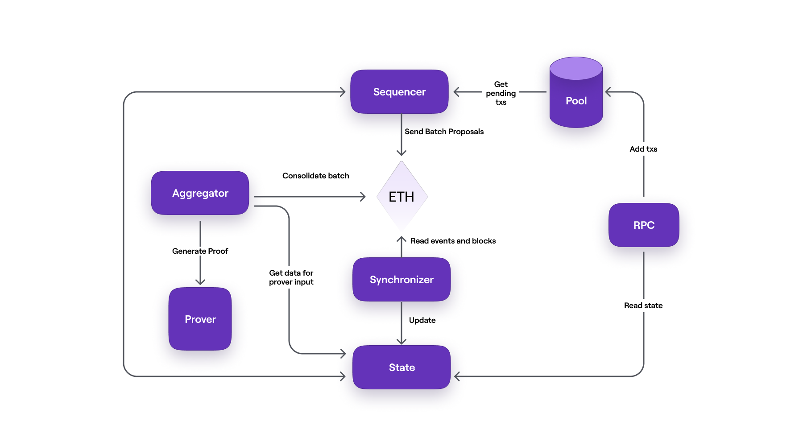

zkNode is the software needed to run a zkEVM node. It is a client that network users require to synchronize and know the state of the Polygon zkEVM.

The main actors influencing the L2 State and its finality are the _trusted Sequencer_ and _trusted Aggregator_.

The zkNode architecture is modular in nature. See the below diagram for more clarity.

Most important to understand, is the primary path taken by transactions; from when users submit the transactions to the zkEVM network up until they are finalized and incorporated in the L1 State.

Polygon zkEVM achieves this by utilizing several actors. Here is a list of the most prominent zkEVM components;

- The **Users**, who connect to the zkEVM network by means of an **RPC** node (e.g., MetaMask), submit their transactions to a database called Pool DB.
- The **Pool DB** is the storage for transactions submitted by Users. These are kept in the pool waiting to be put in a batch by the Sequencer.
- The **Sequencer** is a node responsible for fetching transactions from Pool DB, checking if the transactions are valid, then putting valid ones into a batch. The sequencer submits all batches to the L1 and then sequences the batches. By doing so, the sequenced batches should be included in the L1 State.
- The **Synchronizer** is the component that updates the State DB by fetching data from Ethereum through Etherman.
- The **Etherman** is a low-level component that implements methods for all interactions with the L1 network and smart contracts.
- The **State DB** is a database for permanently storing state data (but not the Merkle trees).
- The **Aggregator** is another node whose role is to produce proofs attesting to the integrity of the Sequencer's proposed state change. These proofs are zero-knowledge proofs (or ZK-proofs) and the Aggregator employs a cryptographic component called the Prover for this purpose.
- The **Prover** is a complex cryptographic tool capable of producing ZK-proofs of hundreds of batches, and aggregating these into a single ZK-proof which is published as the validity proof.

Users can set up their own _local zkNode_ by following this guide [here](../../get-started/setup-nodes/local-node.md), or a production zkNode as detailed [here](../../get-started/setup-nodes/production-node.md).

## zkNode roles

The zkNode software is designed to support execution of multiple roles. Each role requires different services to work. Although most of the services can run in different instances, the JSON RPC can run in many instances (all the other services must have a single instance).

### RPC endpoints

Any user can participate in this role, as an RPC node.

Required services and components:

- JSON RPC: can run in a separated instance, and can have multiple instances
- Synchronizer: single instance that can run on a separate instance
- Executor & Merkletree: service that can run on a separate instance
- State DB: Postgres SQL that can be run in a separate instance

There must be only one synchronizer, and it's recommended that it must have exclusive access to an executor instance, though not necessarily.

 The synchronizer role can be run perfectly in a single instance, but the JSON RPC and executor services can benefit from running in multiple instances, if the performance decreases due to the number of received requests.

- [`zkEVM RPC endpoints`](./docs/json-rpc-endpoints.md)
- [`zkEVM RPC Custom endpoints documentation`](./docs/zkEVM-custom-endpoints.md)

### Trusted sequencer

This role can only be performed by a single entity. This is enforced in the smart contract, as the related methods of the trusted sequencer can only be performed by the owner of a particular private key.

Required services and components:

- JSON RPC: can run in a separated instance, and can have multiple instances
- Sequencer & Synchronizer: single instance that needs to run together
- Executor & Merkletree: service that can run on a separate instance
- Pool DB: Postgres SQL that can be run in a separate instance
- State DB: Postgres SQL that can be run in a separate instance

Note that the JSON RPC is required to receive transactions. It's recommended that the JSON RPC runs on separated instances, and potentially more than one (depending on the load of the network). It's also recommended that the JSON RPC and the Sequencer don't share the same executor instance, to make sure that the sequencer has exclusive access to an executor

### Aggregator

This role can be performed by anyone.

Required services and components:

- Synchronizer: single instance that can run on a separated instance
- Executor & Merkletree: service that can run on a separate instance
- State DB: Postgres SQL that can be run in a separate instance
- Aggregator: single instance that can run on a separated instance
- Prover: single instance that can run on a separated instance
- Executor: single instance that can run on a separated instance

It's recommended that the prover is run on a separate instance, as it has important hardware requirements. On the other hand, all the other components can run on a single instance.

