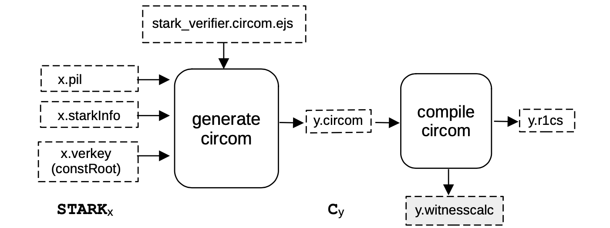
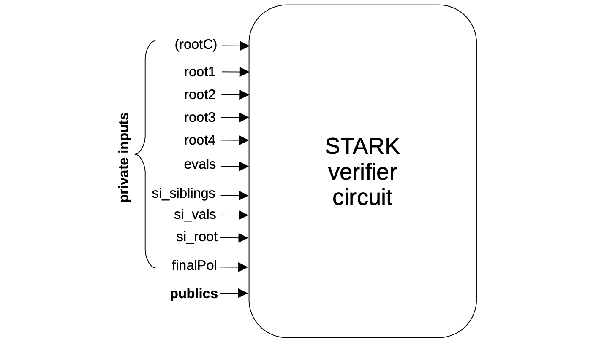
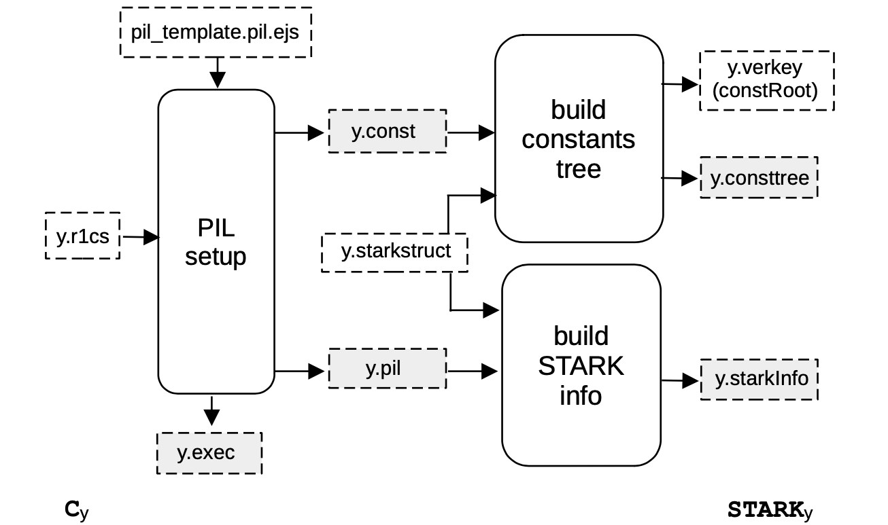

This document provides a deep dive into the sub-processes **S2C** and **C2S** of the Recursion of Proofs.

## Setup S2C

Recall that **S2C** denotes the process of converting a given **STARK** into its Verifier circuit, which is a description in CIRCOM, compiled into the corresponding R1CS constraints.

The architecture of this generic conversion is depicted in the below figure, where a $\mathtt{STARK_x}$ is converted into a circuit denoted as $\textbf{C}_{\text{y}}$.

The input of **S2C** is all the information needed to set up a circuit for verifying the given **STARK**.

In our architecture, the inputs are;

- The PIL file `x.pil`, specifying **STARK** constraints that are going to be validated and the polynomial names,
- The `x.starkInfo` file containing the FRI-related parameters (blowup factor, the number of queries to be done, etc.), and
- The `x.verkey` which is the root (`constRoot`) of the Merkle tree of the computation constants.

The output `y.circom` of the `generate circom`  process, is a **CIRCOM** description.

The circuit is actually generated by filling an `EJS` template for the CIRCOM description using the constraints defined by the PIL file, the FRI-related parameters included in the `starkInfo` file and the `constRoot`.

As illustrated in the below figure, the inputs of the generated **STARK** Verifier circuits are divided in two groups; private inputs and public inputs called `publics`.

The `private inputs` are the parameters of the previous STARK proof:

- `rootC`: Four field elements representing the root of the Merkle tree for the evaluations of constant polynomials (that is, preprocessed polynomials) of the previous **STARK**. In some of the intermediate circuits that we generate, `rootC` is an input of the circuit, while in other generated circuits `rootC` are internal signals hardcoded to the corresponding values. (More information for each particular case is provided later in the documentation).

- `root1`: Four field elements representing the root of the Merkle tree for the evaluations of all the trace column polynomials of the execution trace.

- `root2`: Four field elements representing the root of the Merkle tree for the evaluations of the $h$-polynomials appearing in each lookup argument of the previous **STARK**. This root may be $0$ if no lookup argument is provided in the PIL.

- `root3`: Four field elements representing the root of the Merkle tree for the evaluations of the grand product polynomials appearing in each argument (that is, lookup, permutation or connection arguments) of the previous **STARK**, and the intermediate polynomials appearing in certain splitting of them. This root may be $0$ if no arguments are provided in the PIL.

- `root4`: Four field elements representing the root of the Merkle tree for the evaluations of the splitting $Q_1$ and $Q_2$ of the $Q$ polynomial of the previous **STARK**.

- `evals`: Contains all the necessary evaluations for all the polynomials appearing in the FRI verification process at a challenge value $z$ and at $gz$.

- `si_root`: Four field elements representing the root of the Merkle tree for the evaluations of the $i$-folded FRI polynomial. That is, the polynomial appearing in the $i$-th step of the FRI verification.

- `si_vals`: The leaves’ values of the previous Merkle tree used to check all the queries. The total amount of such values depends on the number of queries and the reduction factor attached to the current step of the FRI.

- `si_siblings`: Merkle proofs for each of the previous evaluations.

- `finalPol`: Contains all the evaluations of the last step’s folding polynomial constructed in the FRI verification procedure, over the last defined domain, which has the same size as the degree of the polynomial.

The `publics` are a set of inputs used by the Verifier to check the final proof, and also by the intermediate STARKs. More information about `publics` used in the zkEVM STARK is provided in later sections of this document.

In order to complete the **S2C** step, the final process is compiling a **STARK** into its CIRCOM description, so as to obtain a file with the associated R1CS constraints and a witness calculator program capable of computing all the values of the circuit wires for a given set of inputs.

Finally, we remark that the particular intermediate circuit generated in a **S2C** step, denoted as $\textbf{C}_{\text{y}}$ as seen in the **S2C** figure above, can be just a verification of the previous $\mathtt{STARK_x}$, if we are applying only one recursion step.

But more generally, other types of circuits, including the Verifier, can be used to provide more functionality. This latter case is applied when circuits are used to verify aggregation of proofs.

## Setup C2S

The proving architecture is designed to create a chain of STARKs. Given a STARK proof, the **S2C** step translates the proof into a Verifier circuit.

In the **C2S** step, which is part of the pre-processing, the Verifier circuit is translated into a STARK proof.

A picture of a generic **C2S** step is displayed in the below Figure, where a circuit denoted by $\textbf{C}_{\text{y}}$ is converted into its corresponding **STARK**, denoted by $\mathtt{STARK}_{\text{y}}$.

As shown in the above figure, the first process of the **C2S** step is the PIL setup, which takes the R1CS constraints of a given intermediate circuit as input, and produces all the **STARK**-related artifacts.

These includes the associated **STARK** identity constraints and the computation constants that are respectively stored in a PIL file (`y.pil`) and in a file of constants (`y.const`).

In particular, the identity constraints of the PlonKish arithmetization are generated by filling an `EJS` template for the associated PIL (for the Polygon zkEVM, the template used is called `compressor12.pil.ejs`).

The PIL setup also generates an important executable file (`y.exec`) which defines how to rearrange the values produced by the `circuit witness calculator` into the appropriate values of the **STARK Execution Trace**.

Note that the rearrangement rules and the computation constants only depend on the circuit shape, which is encoded in the `.r1cs` file generated by the CIRCOM compiler. In other words, these parameters do not depend on the particular values of the circuit wires computed for a particular input.

Nevertheless, we will later on use the rearrangement rules file together with the witness values for a given input to build the **STARK Execution Trace**, which in turn is needed to generate the **STARK** proof.

Finally, we also produce the `starkInfo` file and a Merkle tree with the **STARK** constants.

### Arithmetization

In more detail, the **STARK** arithmetization of the intermediate circuits in our proving architecture is a PlonKish arithmetization with custom gates, using $12$ polynomials for the values of the gate wires of the computation trace.

The STARK arithmetization includes several other custom gates for carrying out specific tasks more efficiently.

In particular, the custom gates providing the various functionalities are;

- **Poseidon**: This custom gate is capable of validating a Poseidon hash from a given eight ($8$) field elements as inputs, four ($4$) field elements as the capacity, and a variable number of output elements.

  More specifically, this circuit implements the MDS matrix as its diffusion layer, and the $7$-th power of field elements computations as the non-linear layer (S-boxes), in executing each of the rounds of the Poseidon hash's sponge construction. The Poseidon hash is documented [here](poseidon-sm.md).

- **Extended Field Operations**: This custom gate is capable of validating multiplications and additions (or a combination of the two) over the extended field $\mathbb{F}_p^3$. The inputs are three ($3$) elements $a$, $b$ and $c$ in $\mathbb{F}_p^3$ and the corresponding output is:

  $$
  a · b + c ∈ \mathbb{F}_p^3
  $$

  where the operations are defined over $\mathbb{F}_p^3$. Observe that one can compute pure multiplications by setting $c$ to be equal to $0$. Similarly, pure additions can be computed by setting b equal to 1.

- **FFT**: This custom gate is in charge of computing Fast Fourier Transforms (FFTs) of a variable size in $\mathbb{F}_p$ or in an extension field.

- **Polynomial Evaluation**: This custom gate is in charge of computing a single evaluation of polynomials in $\mathbb{F}_p^3$ using Horner’s rule. The input consists on a field element $z \in \mathbb{F}_p^3$ and the coefficients of the polynomial p which we are going to evaluate. The output is the evaluation $p(z) \in \mathbb{F}_p^3$.

### Selector Polynomials

Selector polynomials are constant (or pre-processed) polynomials used to activate the custom gates of **STARK**. In particular, the selector polynomials used in the zkProver are; `POSEIDON12`, `GATE`, `CMULADD`, `EVPOL4` and `FFT4`.

The selector `GATE` is actually in charge of activating a basic PlonK gate. The other selectors are in charge of selecting whichever sub-circuit needs to be executed.

In addition, there exists a special selector called `PARTIAL`, which is in charge of distinguishing between partial and full non-linear layers, when executing the Poseidon custom gate.

## Recursion Step Proof

The proof of each intermediate **STARK** needs to be computed in order to generate the final proof. See the diagram in the [**Proving Phase**](stark-recursion-detail.md) subsection.

Each intermediate **STARK** proof is generated using the witness values provided by the execution of the associated `circuit witness calculator` program, which in turn takes as inputs the `publics` and the values of the previous proof.

These values are then rearranged properly in order to build the **STARK** execution trace using the corresponding `.exec` file.

The below figure provides the schema of how the proof of an intermediate **STARK** is generated.

1. Observe that the **STARK** executor process takes the parameters of the previous proof together with the public inputs;

    - the file `x.zkin.proof` which has the proper format for the `witness calculator` generated by the CIRCOM compiler
    - the `y.pil`, which is the PIL code of the current **STARK**
    - the witness calculator program (`y.witnesscalc`) of the associated circuit
    - the `y.exec` file containing rearrangement rules

    With these inputs, the **STARK** executor generates the non-preprocessed part of the **STARK** execution trace (`y.commit`).

2. Next, the **STARK** Prover process takes the execution trace. That is; the committed and constant polynomials, the constant tree, the corresponding PIL file, and the information provided by the `zkevm.starkinfo.json` file; in order to generate the proof.

3. Finally, when the proof is generated, the **STARK** Prover process generates three files:

    - **Proof File** (`y.proof.json`): A JSON file containing the whole **STARK** proof in a `.json` file
    - **Publics File** (`y.public.json`): A JSON file containing only the publics
    - **zkIn File** (`y.zkin.proof.json`): A JSON file combining both the proof and the publics.
